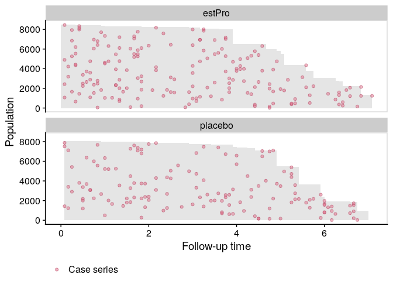
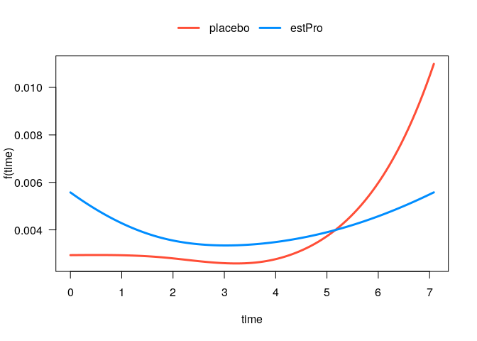
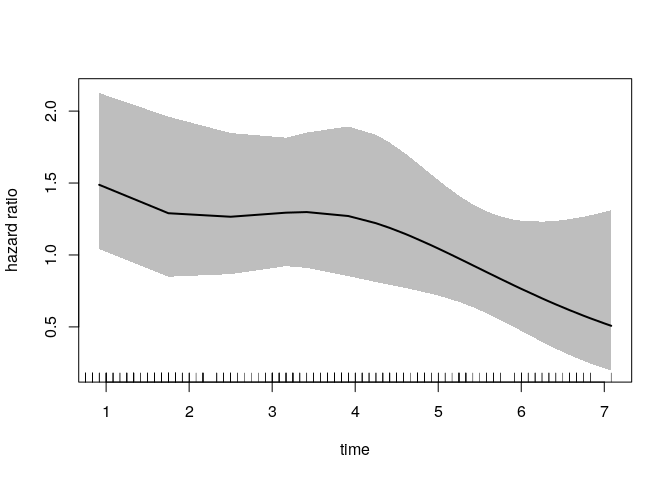
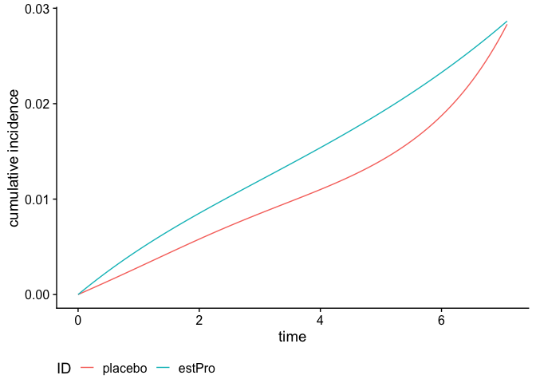

<!-- README.md is generated from README.Rmd. Please edit that file -->

# casebase

<!-- badges: start -->

[](https://travis-ci.org/sahirbhatnagar/casebase)
[](https://codecov.io/github/sahirbhatnagar/casebase?branch=master)
[](https://cran.r-project.org/package=casebase)
[](http://www.r-pkg.org/pkg/casebase)
[](https://ci.appveyor.com/project/sahirbhatnagar/casebase)
[](https://www.tidyverse.org/lifecycle/#maturing)
<!-- badges: end -->

`casebase` is an R package for fitting flexible and fully parametric
hazard regression models to survival data with single event type or
multiple competing causes via logistic and multinomial regression. Our
formulation allows for arbitrary functional forms of time and its
interactions with other predictors for time-dependent hazards and hazard
ratios. From the fitted hazard model, we provide functions to readily
calculate and plot cumulative incidence and survival curves for a given
covariate profile. This approach accommodates any log-linear hazard
function of prognostic time, treatment, and covariates, and readily
allows for non-proportionality. We also provide a plot method for
visualizing incidence density via population time plots.

## Installation

You can install the released version of casebase from
[CRAN](https://CRAN.R-project.org) with:

``` r
install.packages("casebase")
```

And the development version from [GitHub](https://github.com/) with:

``` r
# install.packages("devtools")
devtools::install_github("sahirbhatnagar/casebase")
```

## Vignettes

See the [package website](http://sahirbhatnagar.com/casebase/) for
example usage of the functions. This includes

1.  [Fitting Smooth Hazard
    Functions](http://sahirbhatnagar.com/casebase/articles/smoothHazard.html)
2.  [Competing Risks
    Analysis](http://sahirbhatnagar.com/casebase/articles/competingRisk.html)
3.  [Population Time
    Plots](http://sahirbhatnagar.com/casebase/articles/popTime.html)
4.  [Customizing Population Time
    Plots](http://sahirbhatnagar.com/casebase/articles/customizingpopTime.html)
5.  [Plot Hazards and Hazard
    Ratios](http://sahirbhatnagar.com/casebase/articles/plotsmoothHazard.html)
6.  [Plot Cumulative Incidence and Survival
    Curves](http://sahirbhatnagar.com/casebase/articles/plotabsRisk.html)

## useR\! 2019 Toulouse - Presentation

[](https://www.youtube.com/watch?v=DlppjRYVklQ)

## Quickstart

This is a basic example which shows you some of the main functionalities
of the `casebase` package. We use data from the estrogen plus progestin
trial from the [Women’s Health
Initiative](https://www.doi.org/10.1056/nejmoa030808) (included in the
`casebase` package). This randomized clinical trial investigated the
effect of estrogen plus progestin (`estPro`) on coronary heart disease
(CHD) risk in 16,608 postmenopausal women who were 50 to 79 years of age
at base line. Participants were randomly assigned to receive `estPro` or
`placebo`. The primary efficacy outcome of the trial was CHD (nonfatal
myocardial infarction or death due to CHD).

``` r
library(casebase)
#> See example usage at http://sahirbhatnagar.com/casebase/
library(visreg)
library(splines)
data("eprchd")
```

### Population Time Plots

We first visualize the data with a population time plot. For each
treatment arm, we plot the observed person time in gray, and the case
series as colored dots. It gives us a good visual representation of the
incidence density:

``` r
plot(popTime(eprchd, exposure = "treatment"))
```



### Fit a Smooth Hazard Model

We model the hazard as a function of time, treatment arm and their
interaction:

``` r
eprchd <- transform(eprchd, 
                    treatment = factor(treatment, levels = c("placebo","estPro")))

fit <- fitSmoothHazard(status ~ treatment*ns(time, df = 3),
                       data = eprchd,
                       time = "time")
summary(fit)
#> 
#> Call:
#> glm(formula = formula, family = binomial, data = sampleData)
#> 
#> Deviance Residuals: 
#>     Min       1Q   Median       3Q      Max  
#> -0.2536  -0.1481  -0.1380  -0.1268   3.1490  
#> 
#> Coefficients:
#>                                   Estimate Std. Error z value Pr(>|z|)    
#> (Intercept)                        -5.8604     0.3032 -19.326  < 2e-16 ***
#> treatmentestPro                     0.6316     0.3796   1.664   0.0962 .  
#> ns(time, df = 3)1                  -0.4202     0.3627  -1.158   0.2467    
#> ns(time, df = 3)2                   0.8155     0.7404   1.101   0.2707    
#> ns(time, df = 3)3                   1.4242     0.3474   4.100 4.13e-05 ***
#> treatmentestPro:ns(time, df = 3)1   0.1292     0.4896   0.264   0.7919    
#> treatmentestPro:ns(time, df = 3)2  -1.3944     0.9456  -1.475   0.1403    
#> treatmentestPro:ns(time, df = 3)3  -1.1521     0.4883  -2.359   0.0183 *  
#> ---
#> Signif. codes:  0 '***' 0.001 '**' 0.01 '*' 0.05 '.' 0.1 ' ' 1
#> 
#> (Dispersion parameter for binomial family taken to be 1)
#> 
#>     Null deviance: 3635.4  on 32723  degrees of freedom
#> Residual deviance: 3614.1  on 32716  degrees of freedom
#> AIC: 3630.1
#> 
#> Number of Fisher Scoring iterations: 7
```

Since the output object from `fitSmoothHazard` inherits from the `glm`
class, we see a familiar result when using the function `summary`.

### Time-Dependent Hazard Function

The treatment effect on the hazard is somewhat difficult to interpret
because of its interaction with the spline term on time. In these
situations, it is often more instructive to visualize the relationship.
For example, we can easily plot the hazard function for each treatment
arm:

``` r
plot(fit, hazard.params = list(xvar = "time", by = "treatment"))
#> Conditions used in construction of plot
#> treatment: placebo / estPro
#> offset: 0
```



    #> $fit
    #>      treatment time offset status visregFit visregLwr visregUpr
    #>  [ reached 'max' / getOption("max.print") -- omitted 202 rows ]
    #> 
    #>  [ reached getOption("max.print") -- omitted 2 entries ]
    #> attr(,"class")
    #> [1] "visreg"

### Time-Dependent Hazard Ratio

We can also plot the time-dependent hazard ratio and 95% confidence
band:

``` r
newtime <- quantile(eprchd$time, 
                    probs = seq(0.01, 0.99, 0.01))

# reference category
newdata <- data.frame(treatment = factor("placebo", 
                                         levels = c("placebo", "estPro")), 
                      time = newtime)

plot(fit, 
     type = "hr", 
     newdata = newdata,
     var = "treatment",
     increment = 1,
     xvar = "time",
     ci = T,
     rug = T)
```



### Cumulative Incidence Function (CIF)

We can also calculate and plot the cumulative incidence function:

``` r
smooth_risk <- absoluteRisk(object = fit, 
                            newdata = data.frame(treatment = c("placebo", "estPro")))

plot(smooth_risk, id.names = c("placebo", "estPro"))
```



## Class structure

The `casebase` package uses the following hierarchy of classes for the
output of `fitSmoothHazard`:

    casebase:
      singleEventCB:
        - glm
        - gam
        - gbm
        - cv.glmnet
      CompRisk:
        - vglm

The class `singleEventCB` is an `S3` class, and we also keep track of
the classes appearing below. The class `CompRisk` is an `S4` class that
inherits from `vglm`.

## Credit

This package is makes use of several existing packages including:

  - [`VGAM`](https://cran.r-project.org/package=VGAM) for fitting
    multinomial logistic regression models
  - [`survival`](https://cran.r-project.org/package=survival) for
    survival models
  - [`ggplot2`](https://cran.r-project.org/package=ggplot2) for plotting
    the population time plots
  - [`data.table`](https://cran.r-project.org/package=data.table) for
    efficient handling of large datasets

Other packages with similar objectives but different parametric forms:

  - [`rstpm2`](https://cran.r-project.org/package=rstpm2)
  - [`flexsurv`](https://cran.r-project.org/package=flexsurv)
  - [`SmoothHazard`](https://cran.r-project.org/package=SmoothHazard)

## Citation

``` r
citation('casebase')
#> 
#> To cite casebase in publications use:
#> 
#> Bhatnagar S, Turgeon M, Islam J, Saarela O, Hanley J (2020). _casebase:
#> Fitting Flexible Smooth-in-Time Hazards and Risk Functions via Logistic
#> and Multinomial Regression_. R package version 0.9.0, <URL:
#> https://CRAN.R-project.org/package=casebase>.
#> 
#>   Hanley, James A., and Olli S. Miettinen. Fitting smooth-in-time
#>   prognostic risk functions via logistic regression. International
#>   Journal of Biostatistics 5.1 (2009): 1125-1125.
#> 
#>   Saarela, Olli. A case-base sampling method for estimating recurrent
#>   event intensities. Lifetime data analysis 22.4 (2016): 589-605.
#> 
#> If competing risks analyis is used, please also cite
#> 
#>   Saarela, Olli, and Elja Arjas. Non-parametric Bayesian Hazard
#>   Regression for Chronic Disease Risk Assessment. Scandinavian Journal
#>   of Statistics 42.2 (2015): 609-626.
#> 
#> To see these entries in BibTeX format, use 'print(<citation>,
#> bibtex=TRUE)', 'toBibtex(.)', or set
#> 'options(citation.bibtex.max=999)'.
```

## Contact

  - Issues: <https://github.com/sahirbhatnagar/casebase/issues>
  - Pull Requests: <https://github.com/sahirbhatnagar/casebase/>
  - e-mail: <sahir.bhatnagar@gmail.com>, <max.turgeon@umanitoba.ca>

## Latest news

You can see the most recent changes to the package in the [NEWS
file](https://sahirbhatnagar.com/casebase/news)

## Code of Conduct

Please note that this project is released with a [Contributor Code of
Conduct](https://sahirbhatnagar.com/casebase/CONDUCT.html). By
participating in this project you agree to abide by its terms.
