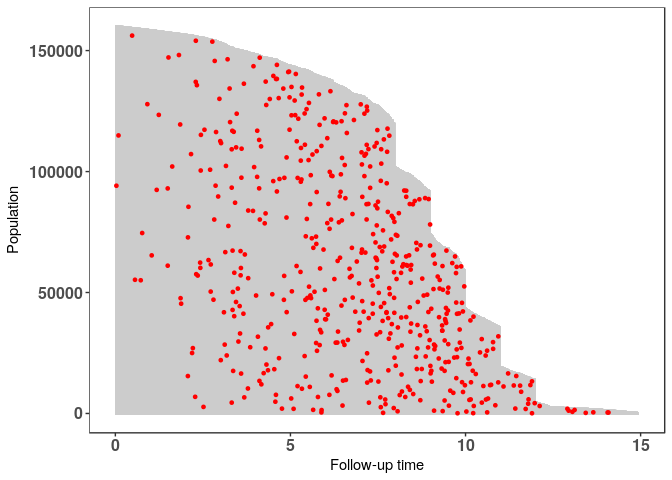
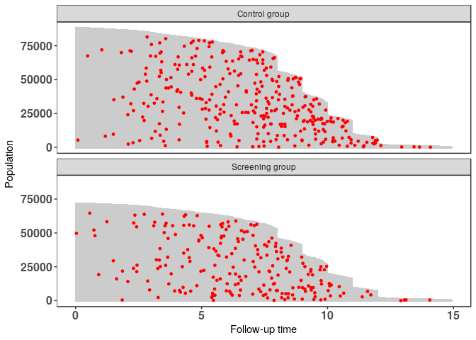
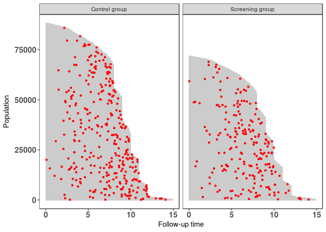
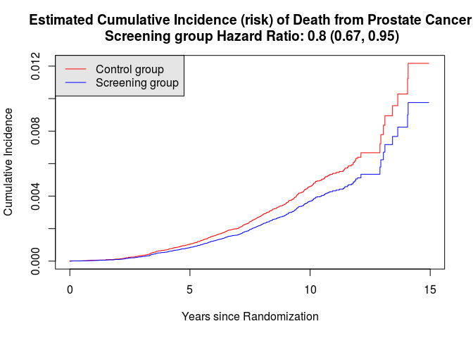
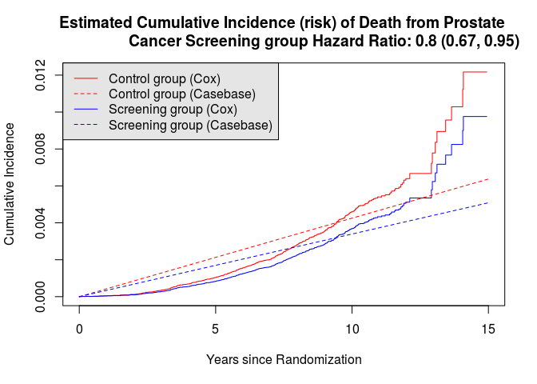
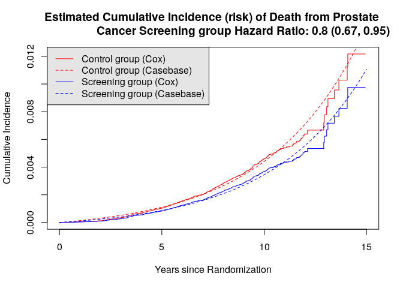
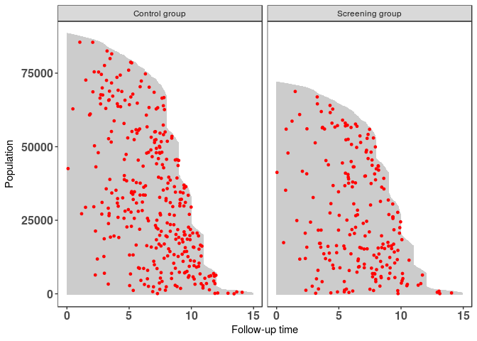

casebase: An Alternative Framework for Survival Analysis
--------------------------------------------------------

This vignette introduces the main functions in the `casebase` package.
The methods implemented in this package are based on the method
developped in [Fitting Smooth-in-Time Prognostic Risk Functions via
Logistic Regression (Hanley and Miettinen,
2009)](https://github.com/sahirbhatnagar/casebase/blob/master/references/Hanley_Miettinen-2009-Inter_J_of_Biostats.pdf).
A rigorous treatment of the theory is developed in [A case-base sampling
method for estimating recurrent event intensities (Saarela,
2015)](https://github.com/sahirbhatnagar/casebase/blob/master/references/Saarela-2015-Lifetime_Data_Analysis.pdf)
and [Non-parametric Bayesian Hazard Regression for Chronic Disease Risk
Assessment](https://github.com/sahirbhatnagar/casebase/blob/master/references/Saarela_et_al-2015-Scandinavian_Journal_of_Statistics.pdf).
The motivation for this work is nicely summarised by Cox:


### Why another package for survival analysis?

The purpose of the `casebase` package is to provide practitioners with
an easy-to-use software tool to predict the risk (or cumulative
incidence (CI)) of an event, for a particular patient. The following
points should be noted:

1.  Time matching/risk set sampling (including Cox partial likelihood)
    eliminates the baseline hazard from the likelihood expression for
    the hazard ratios
2.  If, however, the absolute risks are of interest, they have to be
    recovered using the semi-parametric Breslow estimator
3.  Alternative approaches for fitting flexible hazard models for
    estimating absolute risks, not requiring this two-step approach?
    Yes! [Hanley and Miettinen,
    2009](https://github.com/sahirbhatnagar/casebase/blob/master/references/Hanley_Miettinen-2009-Inter_J_of_Biostats.pdf)

> [Hanley and Miettinen,
> 2009](https://github.com/sahirbhatnagar/casebase/blob/master/references/Hanley_Miettinen-2009-Inter_J_of_Biostats.pdf)
> propose a fully parametric hazard model that can be fit via logistic
> regression. From the fitted hazard function, cumulative incidence and,
> thus, risk functions of time, treatment and profile can be easily
> derived.

### Parametric family of hazard functions

The `casebase` package fits the family of hazard functions of the form

$$ h(x,t) = exp[g(x,t)] $$ where \\( t \\) denotes the numerical value
(number of units) of a point in prognostic/prospective time and \\( x
\\) is the realization of the vector \\( X \\) of variates based on the
patient's profile and intervention (if any). Different functions of \\(
t \\) lead to different parametric hazard models.

The simplest of these models is the one-parameter exponential
distribution which is obtained by taking the hazard function to be
constant over the range of \\( t \\).

$$ h(x,t) = exp(\beta_0 + \beta_1 x) $$

The instantaneous failure rate is independent of \\( t \\), so that the
conditional chance of failure in a time interval of specified length is
the same regardless of how long the individual has been on study a.k.a
the memoryless property (Kalbfleisch and Prentice, 2002).

The Gompertz hazard model is given by including a linear term for time:

$$ h(x,t)  = exp(\beta_0 + \beta_1 t + \beta_2 x) $$

Use of \\( log(t) \\) yields the Weibull hazard which allows for a power
dependence of the hazard on time (Kalbfleisch and Prentice, 2002):

$$ h(x, t)  = exp(\beta_0 + \beta_1 \log(t) + \beta_2 x) $$

Recall that the relative risk model (Cox, 1972)

$$ \lambda(t;x) = \lambda_0(t) exp(\mathbf{X}\boldsymbol{\beta})  $$
where \\( \lambda\_0(\cdot) \\) is an arbitrary unspecified baseline
hazard function for continous time.

Cox Model vs. Case-base Sampling
--------------------------------

In the following table we provide a comparison between the Cox model and
case-base sampling:

<table>
<thead>
<tr>
<th style="text-align:left;">
feature
</th>
<th style="text-align:left;">
Cox
</th>
<th style="text-align:left;">
Case.Base.Sampling
</th>
</tr>
</thead>
<tbody>
<tr>
<td style="text-align:left;">
model type
</td>
<td style="text-align:left;">
semi-parametric
</td>
<td style="text-align:left;">
fully parametric (logistic/multinomial regression)
</td>
</tr>
<tr>
<td style="text-align:left;">
time
</td>
<td style="text-align:left;">
left hand side of the equation
</td>
<td style="text-align:left;">
right hand side - allows flexible modeling of time
</td>
</tr>
<tr>
<td style="text-align:left;">
cumulative incidence
</td>
<td style="text-align:left;">
step function
</td>
<td style="text-align:left;">
smooth-in-time curve
</td>
</tr>
<tr>
<td style="text-align:left;">
non-proportional hazards
</td>
<td style="text-align:left;">
interaction of covariates with time
</td>
<td style="text-align:left;">
interaction of covariates with time
</td>
</tr>
<tr>
<td style="text-align:left;">
model testing
</td>
<td style="text-align:left;">
</td>
<td style="text-align:left;">
make use of GLM framework (LRT, AIC, BIC)
</td>
</tr>
<tr>
<td style="text-align:left;">
competing risks
</td>
<td style="text-align:left;">
difficult
</td>
<td style="text-align:left;">
cause-specific cumulative incidence functions (CIFs) directly obtained
via multinomial regression
</td>
</tr>
<tr>
<td style="text-align:left;">
prediction
</td>
<td style="text-align:left;">
Kaplan-Meier-based
</td>
<td style="text-align:left;">
ROC, AUC, risk reclassification probabilities
</td>
</tr>
</tbody>
</table>
Intuition Behind Casebase sampling
----------------------------------

[Slides from Olli
Saarela](https://www.fields.utoronto.ca/programs/scientific/14-15/biomarker/slides/saarela.pdf)

Load Required Packages
----------------------

We fist load the required packages:

``` {.r}
if (!requireNamespace("pacman", quietly = TRUE)) install.packages("pacman")
pacman::p_load(survival)
pacman::p_load(casebase)
pacman::p_load(splines)
```

European Randomized Study of Prostate Cancer Screening Data
-----------------------------------------------------------

Throughout this vignette, we make use of the European Randomized Study
of Prostate Cancer Screening data which ships with the `casebase`
package:

``` {.r}
data("ERSPC")
head(ERSPC)
```

    ##   ScrArm Follow.Up.Time DeadOfPrCa
    ## 1      1         0.0027          0
    ## 2      1         0.0027          0
    ## 3      1         0.0027          0
    ## 4      0         0.0027          0
    ## 5      0         0.0027          0
    ## 6      0         0.0027          0

``` {.r}
ERSPC$ScrArm <- factor(ERSPC$ScrArm, 
                       levels = c(0,1), 
                       labels = c("Control group", "Screening group"))
```

The results of this study were published by [Schroder FH, et al. N Engl
J Med
2009](https://github.com/sahirbhatnagar/casebase/blob/master/references/Schroder_et_al-2009-NEJM.pdf).
There's a really interesting story on how this data was obtained. See
`help(ERSPC)` and [Liu Z, Rich B, Hanley JA, Recovering the raw data
behind a non-parametric survival curve. Systematic Reviews
2014](https://github.com/sahirbhatnagar/casebase/blob/master/references/Liu_et_al-2015-Systematic_Reviews.pdf)
for further details.

Population Time Plot
--------------------

Population time plots can be extremely informative graphical displays of
survival data. They should be the first step in your exploratory data
analyses. We facilitate this task in the `casebase` package using the
`popTime` function. We first create the necessary dataset for producing
the population time plots:

``` {.r}
pt_object <- casebase::popTime(ERSPC, event = "DeadOfPrCa")
```

    ## 'Follow.Up.Time' will be used as the time variable

    ## Sampling from all remaining individuals under study,
    ##                     regardless of event status

We can see its contents and its class:

``` {.r}
head(pt_object)
```

    ##             ScrArm   time event original.time original.event event status
    ## 1: Screening group 0.0027     0        0.0027              0     censored
    ## 2: Screening group 0.0027     0        0.0027              0     censored
    ## 3: Screening group 0.0027     0        0.0027              0     censored
    ## 4:   Control group 0.0027     0        0.0027              0     censored
    ## 5:   Control group 0.0027     0        0.0027              0     censored
    ## 6:   Control group 0.0027     0        0.0027              0     censored
    ##    ycoord yc n_available
    ## 1: 159893  0           0
    ## 2: 159892  0           0
    ## 3: 159891  0           0
    ## 4: 159890  0           0
    ## 5: 159889  0           0
    ## 6: 159888  0           0

``` {.r}
class(pt_object)
```

    ## [1] "popTime"    "data.table" "data.frame"

The `casebase` package has a `plot` method for objects of class
`popTime`:

``` {.r}
plot(pt_object)
```



> Can you explain the distinct shape of the grey area?

Exposure Stratified Population Time Plot
----------------------------------------

We can also create exposure stratified plots by specifying the
`exposure` argument in the `popTime` function:

``` {.r}
pt_object_strat <- casebase::popTime(ERSPC, 
                                     event = "DeadOfPrCa", 
                                     exposure = "ScrArm")
```

    ## 'Follow.Up.Time' will be used as the time variable

    ## Sampling from all remaining individuals under study,
    ##                     regardless of event status
    ## Sampling from all remaining individuals under study,
    ##                     regardless of event status

We can see its contents and its class:

``` {.r}
head(pt_object_strat)
```

    ## $data
    ##                  ScrArm    time event original.time original.event
    ##      1:   Control group  0.0027     0        0.0027              0
    ##      2:   Control group  0.0027     0        0.0027              0
    ##      3:   Control group  0.0027     0        0.0027              0
    ##      4:   Control group  0.0027     0        0.0027              0
    ##      5:   Control group  0.0137     0        0.0137              0
    ##     ---                                                           
    ## 159889: Screening group 14.9405     0       14.9405              0
    ## 159890: Screening group 14.9405     0       14.9405              0
    ## 159891: Screening group 14.9405     0       14.9405              0
    ## 159892: Screening group 14.9405     0       14.9405              0
    ## 159893: Screening group 14.9405     0       14.9405              0
    ##         event status ycoord yc n_available
    ##      1:     censored  88232  0           0
    ##      2:     censored  88231  0           0
    ##      3:     censored  88230  0           0
    ##      4:     censored  88229  0           0
    ##      5:     censored  88228  0           0
    ##     ---                                   
    ## 159889:     censored      5  0           0
    ## 159890:     censored      4  0           0
    ## 159891:     censored      3  0           0
    ## 159892:     censored      2  0           0
    ## 159893:     censored      1  0           0
    ## 
    ## $exposure
    ## [1] "ScrArm"

``` {.r}
class(pt_object_strat)
```

    ## [1] "popTimeExposure" "list"

The `casebase` package also has a `plot` method for objects of class
`popTimeExposure`:

``` {.r}
plot(pt_object_strat)
```



We can also plot them side-by-side using the `ncol` argument:

``` {.r}
plot(pt_object_strat, ncol = 2)
```



Cox Model
---------

We first fit a Cox model, examine the hazard ratio for the screening
group (relative to the control group), and plot the cumulative incidence
function (CIF).

``` {.r}
cox_model <- survival::coxph(Surv(Follow.Up.Time, DeadOfPrCa) ~ ScrArm, 
                             data = ERSPC)
(sum_cox_model <- summary(cox_model))
```

    ## Call:
    ## survival::coxph(formula = Surv(Follow.Up.Time, DeadOfPrCa) ~ 
    ##     ScrArm, data = ERSPC)
    ## 
    ##   n= 159893, number of events= 540 
    ## 
    ##                         coef exp(coef) se(coef)     z Pr(>|z|)  
    ## ScrArmScreening group -0.222     0.801    0.088 -2.52    0.012 *
    ## ---
    ## Signif. codes:  0 '***' 0.001 '**' 0.01 '*' 0.05 '.' 0.1 ' ' 1
    ## 
    ##                       exp(coef) exp(-coef) lower .95 upper .95
    ## ScrArmScreening group     0.801       1.25     0.674     0.952
    ## 
    ## Concordance= 0.519  (se = 0.011 )
    ## Rsquare= 0   (max possible= 0.075 )
    ## Likelihood ratio test= 6.45  on 1 df,   p=0.0111
    ## Wald test            = 6.37  on 1 df,   p=0.0116
    ## Score (logrank) test = 6.39  on 1 df,   p=0.0115

We can plot the CIF for each group:

``` {.r}
new_data <- data.frame(ScrArm = c("Control group", "Screening group"),
                       ignore = 99)

plot(survfit(cox_model, newdata=new_data),
     xlab = "Years since Randomization", 
     ylab="Cumulative Incidence", 
     fun = "event",
     xlim = c(0,15), conf.int = F, col = c("red","blue"), 
     main = sprintf("Estimated Cumulative Incidence (risk) of Death from Prostate 
                    Cancer Screening group Hazard Ratio: %.2g (%.2g, %.2g)",
                    sum_cox_model$conf.int[,"exp(coef)"], 
                    sum_cox_model$conf.int[,"lower .95"], 
                    sum_cox_model$conf.int[,"upper .95"]))
legend("topleft", 
       legend = c("Control group", "Screening group"), 
       col = c("red","blue"),
       lty = c(1, 1), 
       bg = "gray90")
```



We compare it to the figure in [Schroder FH, et al. N Engl J Med
2009](https://github.com/sahirbhatnagar/casebase/blob/master/references/Schroder_et_al-2009-NEJM.pdf)
and see that the plots are very similar, as is the hazard ratio and 95%
confidence interval:


Case-base Sampling
------------------

Next we fit several models using case-base sampling. The models we fit
differ in how we choose to model time.

The `fitSmoothHazard` function provides an estimate of the hazard
function \\( h(x, t) \\) is the hazard function, \\( t \\) denotes the
numerical value (number of units) of a point in prognostic/prospective
time and \\( x \\) is the realization of the vector \\( X \\) of
variates based on the patient's profile and intervention (if any).

``` {.r}
# set the seed for reproducible output
set.seed(1234)

casebase_exponential <- casebase::fitSmoothHazard(DeadOfPrCa ~ ScrArm, 
                                                  data = ERSPC, 
                                                  ratio = 100, 
                                                  type = "uniform")
```

    ## 'Follow.Up.Time' will be used as the time variable

``` {.r}
summary(casebase_exponential)
```

    ## 
    ## Call:
    ## glm(formula = formula, family = binomial, data = sampleData)
    ## 
    ## Deviance Residuals: 
    ##    Min      1Q  Median      3Q     Max  
    ## -0.148  -0.148  -0.148  -0.132   3.080  
    ## 
    ## Coefficients:
    ##                       Estimate Std. Error z value            Pr(>|z|)    
    ## (Intercept)            -7.7608     0.0557 -139.36 <0.0000000000000002 ***
    ## ScrArmScreening group  -0.2261     0.0884   -2.56               0.011 *  
    ## ---
    ## Signif. codes:  0 '***' 0.001 '**' 0.01 '*' 0.05 '.' 0.1 ' ' 1
    ## 
    ## (Dispersion parameter for binomial family taken to be 1)
    ## 
    ##     Null deviance: 6059.0  on 54539  degrees of freedom
    ## Residual deviance: 6052.3  on 54538  degrees of freedom
    ## AIC: 6056
    ## 
    ## Number of Fisher Scoring iterations: 7

``` {.r}
exp(casebase_exponential$coefficients[2])
```

    ## ScrArmScreening group 
    ##                   0.8

``` {.r}
exp(confint(casebase_exponential)[2,])
```

    ## Waiting for profiling to be done...

    ##  2.5 % 97.5 % 
    ##   0.67   0.95

The `absoluteRisk` function provides an estimate of the cumulative
incidence curves for a specific risk profile using the following
equation:

$$ CI(x, t) = 1 - exp\left[ - \int_0^t h(x, u) \textrm{d}u \right] $$

In the plot below, we overlay the estimated CIF from the casebase
exponential model on the Cox model CIF:

``` {.r}
smooth_risk_exp <- casebase::absoluteRisk(object = casebase_exponential, 
                                          time = seq(0,15,0.1), 
                                          newdata = new_data)

plot(survfit(cox_model, newdata=new_data),
     xlab = "Years since Randomization", 
     ylab="Cumulative Incidence", 
     fun = "event",
     xlim = c(0,15), conf.int = F, col = c("red","blue"), 
     main = sprintf("Estimated Cumulative Incidence (risk) of Death from Prostate 
                    Cancer Screening group Hazard Ratio: %.2g (%.2g, %.2g)",
                    sum_cox_model$conf.int[,"exp(coef)"], 
                    sum_cox_model$conf.int[,"lower .95"], 
                    sum_cox_model$conf.int[,"upper .95"]))
lines(seq(0,15,0.1), smooth_risk_exp[1,], type = "l", col = "red", lty = 2)
lines(seq(0,15,0.1), smooth_risk_exp[2,], type = "l", col = "blue", lty = 2)


legend("topleft", 
       legend = c("Control group (Cox)","Control group (Casebase)",
                  "Screening group (Cox)", "Screening group (Casebase)"), 
       col = c("red","red", "blue","blue"),
       lty = c(1, 2, 1, 2), 
       bg = "gray90")
```



As we can see, the exponential model is not a good fit. Based on what we
observed in the population time plot, where more events are observed
later on in time, this poor fit is expected. A constant hazard model
would overestimate the cumulative incidence earlier on in time, and
underestimate it later on, which is what we see in the cumulative
incidence plot. This example demonstrates the benefits of population
time plots as an exploratory analysis tool.

### Linear Time

Next we enter time linearly into the model:

``` {.r}
casebase_time <- fitSmoothHazard(DeadOfPrCa ~ Follow.Up.Time + ScrArm, 
                                 data = ERSPC, 
                                 ratio = 100, 
                                 type = "uniform")
```

    ## 'Follow.Up.Time' will be used as the time variable

``` {.r}
summary(casebase_time)
```

    ## 
    ## Call:
    ## glm(formula = formula, family = binomial, data = sampleData)
    ## 
    ## Deviance Residuals: 
    ##    Min      1Q  Median      3Q     Max  
    ## -0.391  -0.161  -0.123  -0.095   3.462  
    ## 
    ## Coefficients:
    ##                       Estimate Std. Error z value            Pr(>|z|)    
    ## (Intercept)            -9.0013     0.1116  -80.66 <0.0000000000000002 ***
    ## Follow.Up.Time          0.2174     0.0145   15.04 <0.0000000000000002 ***
    ## ScrArmScreening group  -0.2455     0.0886   -2.77              0.0056 ** 
    ## ---
    ## Signif. codes:  0 '***' 0.001 '**' 0.01 '*' 0.05 '.' 0.1 ' ' 1
    ## 
    ## (Dispersion parameter for binomial family taken to be 1)
    ## 
    ##     Null deviance: 6059.0  on 54539  degrees of freedom
    ## Residual deviance: 5818.9  on 54537  degrees of freedom
    ## AIC: 5825
    ## 
    ## Number of Fisher Scoring iterations: 8

``` {.r}
exp(casebase_time$coefficients)
```

    ##           (Intercept)        Follow.Up.Time ScrArmScreening group 
    ##               0.00012               1.24290               0.78230

``` {.r}
exp(confint(casebase_time))
```

    ## Waiting for profiling to be done...

    ##                          2.5 %  97.5 %
    ## (Intercept)           0.000099 0.00015
    ## Follow.Up.Time        1.208290 1.27878
    ## ScrArmScreening group 0.656812 0.92986

``` {.r}
smooth_risk_time <- casebase::absoluteRisk(object = casebase_time, 
                                          time = seq(0,15,0.1), 
                                          newdata = new_data)

plot(survfit(cox_model, newdata=new_data),
     xlab = "Years since Randomization", 
     ylab="Cumulative Incidence", 
     fun = "event",
     xlim = c(0,15), conf.int = F, col = c("red","blue"), 
     main = sprintf("Estimated Cumulative Incidence (risk) of Death from Prostate 
                    Cancer Screening group Hazard Ratio: %.2g (%.2g, %.2g)",
                    sum_cox_model$conf.int[,"exp(coef)"], 
                    sum_cox_model$conf.int[,"lower .95"], 
                    sum_cox_model$conf.int[,"upper .95"]))
lines(seq(0,15,0.1), smooth_risk_time[1,], type = "l", col = "red", lty = 2)
lines(seq(0,15,0.1), smooth_risk_time[2,], type = "l", col = "blue", lty = 2)

legend("topleft", 
       legend = c("Control group (Cox)","Control group (Casebase)",
                  "Screening group (Cox)", "Screening group (Casebase)"), 
       col = c("red","red", "blue","blue"),
       lty = c(1, 2, 1, 2), 
       bg = "gray90")
```



We see that the Weibull model leads to a better fit.

### Flexible time using BSplines

Next we try to enter a smooth function of time into the model using the
`splines` package

``` {.r}
casebase_splines <- fitSmoothHazard(DeadOfPrCa ~ bs(Follow.Up.Time) + ScrArm, 
                                    data = ERSPC, 
                                    ratio = 100, 
                                    type = "uniform")
```

    ## 'Follow.Up.Time' will be used as the time variable

``` {.r}
summary(casebase_splines)
```

    ## 
    ## Call:
    ## glm(formula = formula, family = binomial, data = sampleData)
    ## 
    ## Deviance Residuals: 
    ##    Min      1Q  Median      3Q     Max  
    ## -0.437  -0.173  -0.135  -0.085   3.803  
    ## 
    ## Coefficients:
    ##                       Estimate Std. Error z value             Pr(>|z|)    
    ## (Intercept)           -10.3009     0.3182  -32.37 < 0.0000000000000002 ***
    ## bs(Follow.Up.Time)1     4.4289     0.8088    5.48       0.000000043451 ***
    ## bs(Follow.Up.Time)2     1.9887     0.4875    4.08       0.000045142561 ***
    ## bs(Follow.Up.Time)3     4.7511     0.7215    6.59       0.000000000045 ***
    ## ScrArmScreening group  -0.2097     0.0886   -2.37                0.018 *  
    ## ---
    ## Signif. codes:  0 '***' 0.001 '**' 0.01 '*' 0.05 '.' 0.1 ' ' 1
    ## 
    ## (Dispersion parameter for binomial family taken to be 1)
    ## 
    ##     Null deviance: 6059.0  on 54539  degrees of freedom
    ## Residual deviance: 5789.2  on 54535  degrees of freedom
    ## AIC: 5799
    ## 
    ## Number of Fisher Scoring iterations: 8

``` {.r}
exp(casebase_splines$coefficients)
```

    ##           (Intercept)   bs(Follow.Up.Time)1   bs(Follow.Up.Time)2 
    ##              0.000034             83.840791              7.305938 
    ##   bs(Follow.Up.Time)3 ScrArmScreening group 
    ##            115.710908              0.810854

``` {.r}
exp(confint(casebase_splines))
```

    ## Waiting for profiling to be done...

    ##                           2.5 %     97.5 %
    ## (Intercept)            0.000017   0.000061
    ## bs(Follow.Up.Time)1   17.745271 424.854594
    ## bs(Follow.Up.Time)2    2.900215  19.704298
    ## bs(Follow.Up.Time)3   26.568668 455.040311
    ## ScrArmScreening group  0.680804   0.963786

``` {.r}
smooth_risk_splines <- absoluteRisk(object = casebase_splines, 
                                    time = seq(0,15,0.1), 
                                    newdata = new_data)

plot(survfit(cox_model, newdata=new_data),
     xlab = "Years since Randomization", 
     ylab="Cumulative Incidence", 
     fun = "event",
     xlim = c(0,15), conf.int = F, col = c("red","blue"), 
     main = sprintf("Estimated Cumulative Incidence (risk) of Death from Prostate 
                    Cancer Screening group Hazard Ratio: %.2g (%.2g, %.2g)",
                    sum_cox_model$conf.int[,"exp(coef)"], 
                    sum_cox_model$conf.int[,"lower .95"], 
                    sum_cox_model$conf.int[,"upper .95"]))
lines(seq(0,15,0.1), smooth_risk_splines[1,], type = "l", col = "red", lty = 2)
lines(seq(0,15,0.1), smooth_risk_splines[2,], type = "l", col = "blue", lty = 2)

legend("topleft", 
       legend = c("Control group (Cox)","Control group (Casebase)",
                  "Screening group (Cox)", "Screening group (Casebase)"), 
       col = c("red","red", "blue","blue"),
       lty = c(1, 2, 1, 2), 
       bg = "gray90")
```



It looks like the best fit.

Comparing Models Using Likelihood Ratio Test
--------------------------------------------

Since we are in the GLM framework, we can easily test for which model
better fits the data using a Likelihood ratio test (LRT). The null
hypothesis here is that the linear model is just as good as the larger
(in terms of number of parameters) splines model.

``` {.r}
anova(casebase_time, casebase_splines, test = "LRT")
```

    ## Analysis of Deviance Table
    ## 
    ## Model 1: DeadOfPrCa ~ Follow.Up.Time + ScrArm + offset(offset)
    ## Model 2: DeadOfPrCa ~ bs(Follow.Up.Time) + ScrArm + offset(offset)
    ##   Resid. Df Resid. Dev Df Deviance   Pr(>Chi)    
    ## 1     54537       5819                           
    ## 2     54535       5789  2     29.7 0.00000036 ***
    ## ---
    ## Signif. codes:  0 '***' 0.001 '**' 0.01 '*' 0.05 '.' 0.1 ' ' 1

We see that splines model is the better fit.

Session Information
-------------------

``` {.r}
print(sessionInfo(), locale = F)
```

    ## R version 3.3.2 (2016-10-31)
    ## Platform: x86_64-pc-linux-gnu (64-bit)
    ## Running under: Ubuntu 16.04.1 LTS
    ## 
    ## attached base packages:
    ## [1] splines   stats     graphics  grDevices utils     datasets  methods  
    ## [8] base     
    ## 
    ## other attached packages:
    ## [1] casebase_0.1.0  survival_2.40-1
    ## 
    ## loaded via a namespace (and not attached):
    ##  [1] Rcpp_0.12.10       knitr_1.15.1       magrittr_1.5      
    ##  [4] MASS_7.3-45        munsell_0.4.3      colorspace_1.3-2  
    ##  [7] lattice_0.20-34    stringr_1.2.0      plyr_1.8.4        
    ## [10] tools_3.3.2        grid_3.3.2         data.table_1.10.4 
    ## [13] gtable_0.2.0       pacman_0.4.1       htmltools_0.3.6   
    ## [16] assertthat_0.1     yaml_2.1.14        lazyeval_0.2.0    
    ## [19] rprojroot_1.2      digest_0.6.12      tibble_1.2        
    ## [22] Matrix_1.2-7.1     ggplot2_2.2.1      VGAM_1.0-3        
    ## [25] evaluate_0.10      rmarkdown_1.3.9003 labeling_0.3      
    ## [28] stringi_1.1.3      scales_0.4.1       backports_1.0.5   
    ## [31] stats4_3.3.2
