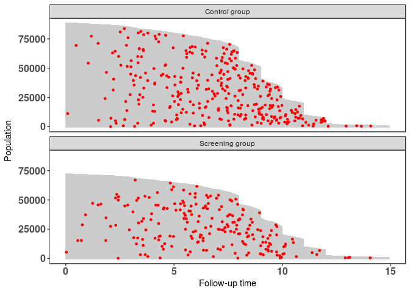
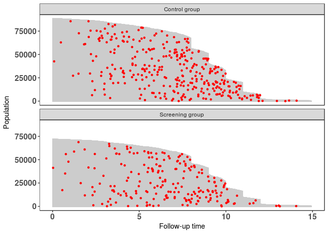

casebase: An Alternative Framework for Survival Analysis
--------------------------------------------------------

This vignette introduces the main functions in the `casebase` package.
The methods implemented in this package are based on the theory
developped in [Fitting Smooth-in-Time Prognostic Risk Functions via
Logistic Regression (Hanley and Miettinen,
2009)](https://github.com/sahirbhatnagar/casebase/blob/master/references/Hanley_Miettinen-2009-Inter_J_of_Biostats.pdf).
The motivation for this work is nicely summarised by Cox:


The purpose of the `casebase` package is to provide practitioners with
an easy-to-use software tool to predict the risk (or cumulative
incidence (CI)) of an event, for a particular patient. The following
points should be noted:

1.  Time matching/risk set sampling (including Cox partial likelihood)
    eliminates the baseline hazard from the likelihood expression for
    the hazard ratios
2.  If, however, the absolute risks are of interest, they have to be
    recovered using the semi-parametric Breslow estimator
3.  Alternative approaches for fitting flexible hazard models for
    estimating absolute risks, not requiring this two-step approach?
    Yes! [Hanley and Miettinen,
    2009](https://github.com/sahirbhatnagar/casebase/blob/master/references/Hanley_Miettinen-2009-Inter_J_of_Biostats.pdf)

> [Hanley and Miettinen,
> 2009](https://github.com/sahirbhatnagar/casebase/blob/master/references/Hanley_Miettinen-2009-Inter_J_of_Biostats.pdf)
> propose a fully parametric hazard model that can be fit via logistic
> regression. From the fitted hazard function, cumulative incidence and,
> thus, risk functions of time, treatment and profile can be easily
> derived.

Cox Model vs. Case-base Sampling
--------------------------------

In the following table we provide a comparison between the Cox model and
case-base sampling:

  ------------------------------------------------------------------------
              Cox              Case Base Sampling
  ----------- ---------------- -------------------------------------------
  model type  semi-parametric  fully parametric (logistic/multinomial
                               regression)

  time        left hand side   right hand side - allows flexible modeling
              of the equation  of time

  cumulative  step function    smooth-in-time curve
  incidence                    

  non-proport interaction of   handled directly by modeling time as a
  ional       covariates with  covariate
  hazards     time             

  model                        make use of GLM framework (LRT, AIC, BIC)
  testing                      

  competing   difficult        cause-specific cumulative incidence
  risks                        functions (CIFs) directly obtained via
                               multinomial regression
  ------------------------------------------------------------------------

Load Required Packages
----------------------

We fist install and load the required packages:

``` {.r}
if (!requireNamespace("pacman", quietly = TRUE)) install.packages("pacman")
pacman::p_load(survival)
pacman::p_load(casebase)
pacman::p_load(splines)
```

European Randomized Study of Prostate Cancer Screening Data
-----------------------------------------------------------

Throughout this vignette, we make use of the European Randomized Study
of Prostate Cancer Screening data which ships with the `casebase`
package:

``` {.r}
data("ERSPC")
head(ERSPC)
```

    ##   ScrArm Follow.Up.Time DeadOfPrCa
    ## 1      1         0.0027          0
    ## 2      1         0.0027          0
    ## 3      1         0.0027          0
    ## 4      0         0.0027          0
    ## 5      0         0.0027          0
    ## 6      0         0.0027          0

``` {.r}
ERSPC$ScrArm <- factor(ERSPC$ScrArm, levels = c(0,1), labels = c("Control group", "Screening group"))
```

The results of this study were published by [Schroder FH, et al. N Engl
J Med
2009](https://github.com/sahirbhatnagar/casebase/blob/master/references/Schroder_et_al-2009-NEJM.pdf).
There's a really interesting story on how this data was obtained. See
`help(ERSPC)` and [Liu Z, Rich B, Hanley JA, Recovering the raw data
behind a non-parametric survival curve. Systematic Reviews
2014](https://github.com/sahirbhatnagar/casebase/blob/master/references/Liu_et_al-2015-Systematic_Reviews.pdf)
for further details.

Population Time Plot
--------------------

Population time plots can be extremely informative graphical displays of
survival data. They should be the first step in your exploratory data
analyses. We facilitate this task in the `casebase` package using the
`popTime` function. We first create the necessary dataset for producing
the population time plots:

``` {.r}
pt_object <- casebase::popTime(ERSPC, event = "DeadOfPrCa")
```

    ## 'Follow.Up.Time' will be used as the time variable

    ## Sampling from all remaining individuals under study,
    ##                     regardless of event status

We can see its contents and its class:

``` {.r}
head(pt_object)
```

    ##             ScrArm   time event original.time original.event event status
    ## 1: Screening group 0.0027     0        0.0027              0     censored
    ## 2: Screening group 0.0027     0        0.0027              0     censored
    ## 3: Screening group 0.0027     0        0.0027              0     censored
    ## 4:   Control group 0.0027     0        0.0027              0     censored
    ## 5:   Control group 0.0027     0        0.0027              0     censored
    ## 6:   Control group 0.0027     0        0.0027              0     censored
    ##    ycoord yc n_available
    ## 1: 159893  0           0
    ## 2: 159892  0           0
    ## 3: 159891  0           0
    ## 4: 159890  0           0
    ## 5: 159889  0           0
    ## 6: 159888  0           0

``` {.r}
class(pt_object)
```

    ## [1] "popTime"    "data.table" "data.frame"

The `casebase` package has a `plot` method for objects of class
`popTime` and `popTimeExposure`:

``` {.r}
plot(pt_object)
```


> Can you explain the distinct shape of the grey area?

Exposure Stratified Population Time Plot
----------------------------------------

We can also create exposure stratified plots by specifying the
`exposure` argument in the `popTime` function:

``` {.r}
pt_object_strat <- casebase::popTime(ERSPC, event = "DeadOfPrCa", exposure = "ScrArm")
```

    ## 'Follow.Up.Time' will be used as the time variable

    ## Sampling from all remaining individuals under study,
    ##                     regardless of event status
    ## Sampling from all remaining individuals under study,
    ##                     regardless of event status

We can see its contents and its class:

``` {.r}
head(pt_object_strat)
```

    ## $data
    ##                  ScrArm    time event original.time original.event
    ##      1:   Control group  0.0027     0        0.0027              0
    ##      2:   Control group  0.0027     0        0.0027              0
    ##      3:   Control group  0.0027     0        0.0027              0
    ##      4:   Control group  0.0027     0        0.0027              0
    ##      5:   Control group  0.0137     0        0.0137              0
    ##     ---                                                           
    ## 159889: Screening group 14.9405     0       14.9405              0
    ## 159890: Screening group 14.9405     0       14.9405              0
    ## 159891: Screening group 14.9405     0       14.9405              0
    ## 159892: Screening group 14.9405     0       14.9405              0
    ## 159893: Screening group 14.9405     0       14.9405              0
    ##         event status ycoord yc n_available
    ##      1:     censored  88232  0           0
    ##      2:     censored  88231  0           0
    ##      3:     censored  88230  0           0
    ##      4:     censored  88229  0           0
    ##      5:     censored  88228  0           0
    ##     ---                                   
    ## 159889:     censored      5  0           0
    ## 159890:     censored      4  0           0
    ## 159891:     censored      3  0           0
    ## 159892:     censored      2  0           0
    ## 159893:     censored      1  0           0
    ## 
    ## $exposure
    ## [1] "ScrArm"

``` {.r}
class(pt_object_strat)
```

    ## [1] "popTimeExposure" "list"

The `casebase` package has a `plot` method for objects of class
`popTime` and `popTimeExposure`:

``` {.r}
plot(pt_object_strat)
```



We can also plot them side-by-side using the `ncol` argument:

``` {.r}
plot(pt_object_strat, ncol = 2)
```


Cox Model
---------

We first fit a Cox model, examine the hazard ratio for the screening
group (relative to the control group), and plot the cumulative incidence
function (CIF).

``` {.r}
cox_model <- survival::coxph( Surv(Follow.Up.Time, DeadOfPrCa) ~ ScrArm, data = ERSPC)
(sum_cox_model <- summary(cox_model))
```

    ## Call:
    ## survival::coxph(formula = Surv(Follow.Up.Time, DeadOfPrCa) ~ 
    ##     ScrArm, data = ERSPC)
    ## 
    ##   n= 159893, number of events= 540 
    ## 
    ##                         coef exp(coef) se(coef)     z Pr(>|z|)  
    ## ScrArmScreening group -0.222     0.801    0.088 -2.52    0.012 *
    ## ---
    ## Signif. codes:  0 '***' 0.001 '**' 0.01 '*' 0.05 '.' 0.1 ' ' 1
    ## 
    ##                       exp(coef) exp(-coef) lower .95 upper .95
    ## ScrArmScreening group     0.801       1.25     0.674     0.952
    ## 
    ## Concordance= 0.519  (se = 0.011 )
    ## Rsquare= 0   (max possible= 0.075 )
    ## Likelihood ratio test= 6.45  on 1 df,   p=0.0111
    ## Wald test            = 6.37  on 1 df,   p=0.0116
    ## Score (logrank) test = 6.39  on 1 df,   p=0.0115

``` {.r}
sum_cox_model$coefficients[,"exp(coef)"]
```

    ## [1] 0.8

We can plot the CIF for each group:

``` {.r}
new_data <- data.frame(ScrArm = c("Control group", "Screening group"),
                       ignore = 99)

plot(survfit(cox_model, newdata=new_data),
     xlab = "Years since Randomization", 
     ylab="Cumulative Incidence", 
     fun = "event",
     xlim = c(0,15), conf.int = F, col = c("red","blue"), 
     main = sprintf("Estimated Cumulative Incidence (risk) of Death from Prostate Cancer\n Screening group Hazard Ratio: %.2g (%.2g, %.2g)",
                    sum_cox_model$conf.int[,"exp(coef)"], sum_cox_model$conf.int[,"lower .95"], sum_cox_model$conf.int[,"upper .95"]))
legend("topleft", 
       legend = c("Control group", "Screening group"), 
       col = c("red","blue"),
       lty = c(1, 1), 
       bg = "gray90")
```


Case-base Sampling
------------------

Next we fit several models using case-base sampling. The models we fit
differ in how we choose to model time.

The `fitSmoothHazard` function provides an estimate of the hazard
function \\( h(x, t) \\) is the hazard function, \\( t \\) denotes the
numerical value (number of units) of a point in prognostic/prospective
time and \\( x \\) is the realization of the vector \\( X \\) of
variates based on the patient's profile and intervention (if any).

``` {.r}
casebase_exponential <- casebase::fitSmoothHazard(DeadOfPrCa ~ ScrArm, 
                                                  data = ERSPC, 
                                                  ratio = 100, 
                                                  type = "uniform")
```

    ## 'Follow.Up.Time' will be used as the time variable

``` {.r}
summary(casebase_exponential)
```

    ## 
    ## Call:
    ## glm(formula = formula, family = binomial, data = sampleData)
    ## 
    ## Deviance Residuals: 
    ##    Min      1Q  Median      3Q     Max  
    ## -0.148  -0.148  -0.148  -0.133   3.079  
    ## 
    ## Coefficients:
    ##                       Estimate Std. Error z value            Pr(>|z|)    
    ## (Intercept)            -7.7642     0.0557 -139.42 <0.0000000000000002 ***
    ## ScrArmScreening group  -0.2185     0.0884   -2.47               0.013 *  
    ## ---
    ## Signif. codes:  0 '***' 0.001 '**' 0.01 '*' 0.05 '.' 0.1 ' ' 1
    ## 
    ## (Dispersion parameter for binomial family taken to be 1)
    ## 
    ##     Null deviance: 6059.0  on 54539  degrees of freedom
    ## Residual deviance: 6052.8  on 54538  degrees of freedom
    ## AIC: 6057
    ## 
    ## Number of Fisher Scoring iterations: 7

``` {.r}
exp(casebase_exponential$coefficients[2])
```

    ## ScrArmScreening group 
    ##                   0.8

``` {.r}
exp(confint(casebase_exponential)[2,])
```

    ## Waiting for profiling to be done...

    ##  2.5 % 97.5 % 
    ##   0.68   0.95

The `absoluteRisk` function provides an estimate of the cumulative
incidence curves for a specific risk profile using the following
equation:

$$ CI(x, t) = 1 - exp\left[ - \int_0^t h(x, u) \textrm{d}u \right] $$

In the plot below, we overlay the estimated CIF from the casebase
exponential model on the Cox model CIF:

``` {.r}
smooth_risk_exp <- casebase::absoluteRisk(object = casebase_exponential, 
                                          time = seq(0,15,0.1), 
                                          newdata = new_data)

plot(survfit(cox_model, newdata=new_data),
     xlab = "Years since Randomization", 
     ylab="Cumulative Incidence", 
     fun = "event",
     xlim = c(0,15), conf.int = F, col = c("red","blue"), 
     main = sprintf("Estimated Cumulative Incidence (risk) of Death from Prostate Cancer\n Screening group Hazard Ratio: %.2g (%.2g, %.2g)",
                    sum_cox_model$conf.int[,"exp(coef)"], sum_cox_model$conf.int[,"lower .95"], sum_cox_model$conf.int[,"upper .95"]))
lines(seq(0,15,0.1), smooth_risk_exp[1,], type = "l", col = "red", lty = 2)
lines(seq(0,15,0.1), smooth_risk_exp[2,], type = "l", col = "blue", lty = 2)


legend("topleft", 
       legend = c("Control group (Cox)","Control group (Casebase)",
                  "Screening group (Cox)", "Screening group (Casebase)"), 
       col = c("red","red", "blue","blue"),
       lty = c(1, 2, 1, 2), 
       bg = "gray90")
```


### Linear Time

``` {.r}
casebase_time <- casebase::fitSmoothHazard(DeadOfPrCa ~ Follow.Up.Time + ScrArm, 
                                           data = ERSPC, 
                                           ratio = 100, 
                                           type = "uniform")
```

    ## 'Follow.Up.Time' will be used as the time variable

``` {.r}
summary(casebase_time)
```

    ## 
    ## Call:
    ## glm(formula = formula, family = binomial, data = sampleData)
    ## 
    ## Deviance Residuals: 
    ##    Min      1Q  Median      3Q     Max  
    ## -0.377  -0.162  -0.123  -0.095   3.465  
    ## 
    ## Coefficients:
    ##                       Estimate Std. Error z value            Pr(>|z|)    
    ## (Intercept)            -9.0201     0.1123  -80.33 <0.0000000000000002 ***
    ## Follow.Up.Time          0.2202     0.0146   15.11 <0.0000000000000002 ***
    ## ScrArmScreening group  -0.2384     0.0886   -2.69              0.0072 ** 
    ## ---
    ## Signif. codes:  0 '***' 0.001 '**' 0.01 '*' 0.05 '.' 0.1 ' ' 1
    ## 
    ## (Dispersion parameter for binomial family taken to be 1)
    ## 
    ##     Null deviance: 6059.0  on 54539  degrees of freedom
    ## Residual deviance: 5816.2  on 54537  degrees of freedom
    ## AIC: 5822
    ## 
    ## Number of Fisher Scoring iterations: 8

``` {.r}
exp(casebase_time$coefficients)
```

    ##           (Intercept)        Follow.Up.Time ScrArmScreening group 
    ##               0.00012               1.24632               0.78791

``` {.r}
exp(confint(casebase_time))
```

    ## Waiting for profiling to be done...

    ##                          2.5 %  97.5 %
    ## (Intercept)           0.000097 0.00015
    ## Follow.Up.Time        1.211365 1.28258
    ## ScrArmScreening group 0.661523 0.93653

``` {.r}
smooth_risk_time <- casebase::absoluteRisk(object = casebase_time, 
                                          time = seq(0,15,0.1), 
                                          newdata = new_data)

plot(survfit(cox_model, newdata=new_data),
     xlab = "Years since Randomization", 
     ylab="Cumulative Incidence", 
     fun = "event",
     xlim = c(0,15), conf.int = F, col = c("red","blue"), 
     main = sprintf("Estimated Cumulative Incidence (risk) of Death from Prostate Cancer\n Screening group Hazard Ratio: %.2g (%.2g, %.2g)",
                    sum_cox_model$conf.int[,"exp(coef)"], sum_cox_model$conf.int[,"lower .95"], sum_cox_model$conf.int[,"upper .95"]))
lines(seq(0,15,0.1), smooth_risk_time[1,], type = "l", col = "red", lty = 2)
lines(seq(0,15,0.1), smooth_risk_time[2,], type = "l", col = "blue", lty = 2)

legend("topleft", 
       legend = c("Control group (Cox)","Control group (Casebase)",
                  "Screening group (Cox)", "Screening group (Casebase)"), 
       col = c("red","red", "blue","blue"),
       lty = c(1, 2, 1, 2), 
       bg = "gray90")
```


### Flexible time using BSplines

``` {.r}
casebase_splines <- casebase::fitSmoothHazard(DeadOfPrCa ~ bs(Follow.Up.Time) + ScrArm, 
                                           data = ERSPC, 
                                           ratio = 100, 
                                           type = "uniform")
```

    ## 'Follow.Up.Time' will be used as the time variable

``` {.r}
summary(casebase_splines)
```

    ## 
    ## Call:
    ## glm(formula = formula, family = binomial, data = sampleData)
    ## 
    ## Deviance Residuals: 
    ##    Min      1Q  Median      3Q     Max  
    ## -0.459  -0.173  -0.135  -0.085   3.808  
    ## 
    ## Coefficients:
    ##                       Estimate Std. Error z value             Pr(>|z|)    
    ## (Intercept)           -10.3189     0.3208  -32.17 < 0.0000000000000002 ***
    ## bs(Follow.Up.Time)1     4.4814     0.8196    5.47       0.000000045552 ***
    ## bs(Follow.Up.Time)2     1.9707     0.5026    3.92       0.000088251848 ***
    ## bs(Follow.Up.Time)3     4.8713     0.7524    6.47       0.000000000095 ***
    ## ScrArmScreening group  -0.2097     0.0886   -2.37                0.018 *  
    ## ---
    ## Signif. codes:  0 '***' 0.001 '**' 0.01 '*' 0.05 '.' 0.1 ' ' 1
    ## 
    ## (Dispersion parameter for binomial family taken to be 1)
    ## 
    ##     Null deviance: 6059.0  on 54539  degrees of freedom
    ## Residual deviance: 5785.2  on 54535  degrees of freedom
    ## AIC: 5795
    ## 
    ## Number of Fisher Scoring iterations: 9

``` {.r}
exp(casebase_splines$coefficients)
```

    ##           (Intercept)   bs(Follow.Up.Time)1   bs(Follow.Up.Time)2 
    ##              0.000033             88.360482              7.175770 
    ##   bs(Follow.Up.Time)3 ScrArmScreening group 
    ##            130.489344              0.810828

``` {.r}
exp(confint(casebase_splines))
```

    ## Waiting for profiling to be done...

    ##                           2.5 %    97.5 %
    ## (Intercept)            0.000017   0.00006
    ## bs(Follow.Up.Time)1   18.326261 457.25128
    ## bs(Follow.Up.Time)2    2.770128  19.97915
    ## bs(Follow.Up.Time)3   28.092837 543.12946
    ## ScrArmScreening group  0.680777   0.96376

``` {.r}
smooth_risk_splines <- casebase::absoluteRisk(object = casebase_splines, 
                                              time = seq(0,15,0.1), 
                                              newdata = new_data)

plot(survfit(cox_model, newdata=new_data),
     xlab = "Years since Randomization", 
     ylab="Cumulative Incidence", 
     fun = "event",
     xlim = c(0,15), conf.int = F, col = c("red","blue"), 
     main = sprintf("Estimated Cumulative Incidence (risk) of Death from Prostate Cancer\n Screening group Hazard Ratio: %.2g (%.2g, %.2g)",
                    sum_cox_model$conf.int[,"exp(coef)"], sum_cox_model$conf.int[,"lower .95"], sum_cox_model$conf.int[,"upper .95"]))
lines(seq(0,15,0.1), smooth_risk_splines[1,], type = "l", col = "red", lty = 2)
lines(seq(0,15,0.1), smooth_risk_splines[2,], type = "l", col = "blue", lty = 2)

legend("topleft", 
       legend = c("Control group (Cox)","Control group (Casebase)",
                  "Screening group (Cox)", "Screening group (Casebase)"), 
       col = c("red","red", "blue","blue"),
       lty = c(1, 2, 1, 2), 
       bg = "gray90")
```



Comparing Models Using Likelihood Ratio Test
--------------------------------------------

``` {.r}
anova(casebase_time, casebase_splines, test = "LRT")
```

    ## Analysis of Deviance Table
    ## 
    ## Model 1: DeadOfPrCa ~ Follow.Up.Time + ScrArm + offset(offset)
    ## Model 2: DeadOfPrCa ~ bs(Follow.Up.Time) + ScrArm + offset(offset)
    ##   Resid. Df Resid. Dev Df Deviance   Pr(>Chi)    
    ## 1     54537       5816                           
    ## 2     54535       5785  2       31 0.00000019 ***
    ## ---
    ## Signif. codes:  0 '***' 0.001 '**' 0.01 '*' 0.05 '.' 0.1 ' ' 1

``` {.r}
knitr::knit_exit()
```
