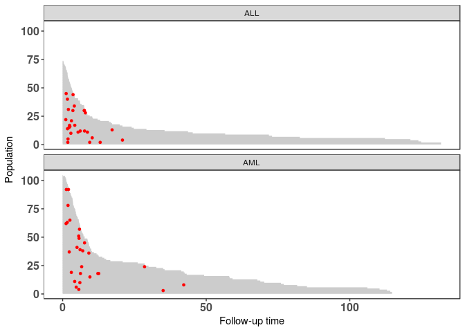
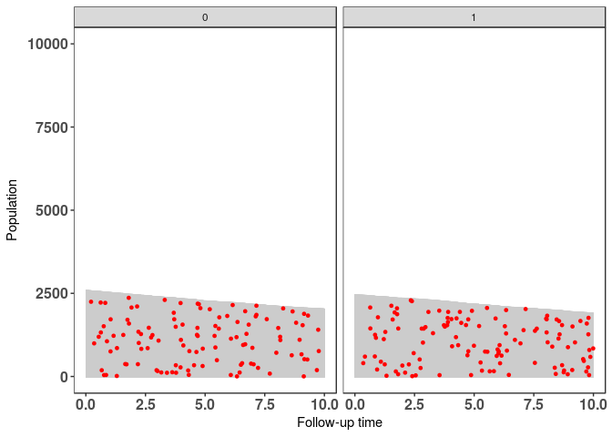
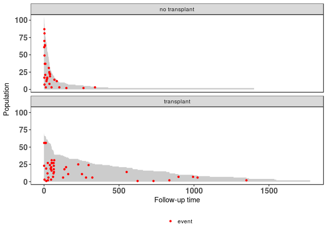
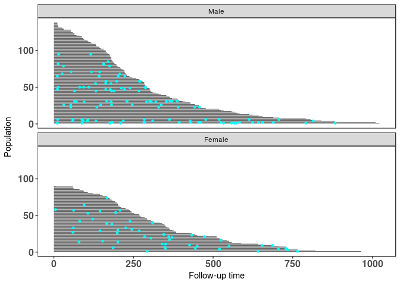
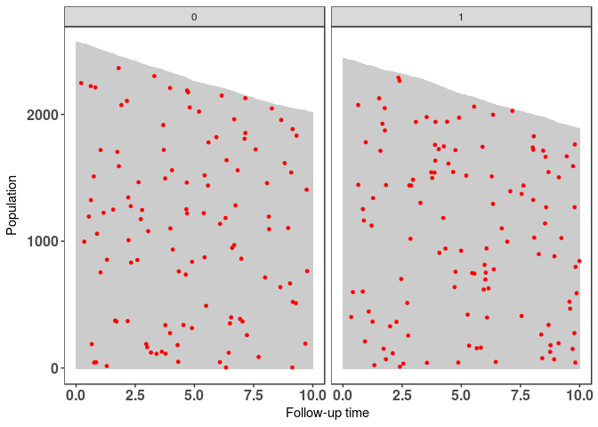

Overview
--------

Population time plots can be extremely informative graphical displays of survival data. They should be the first step in your exploratory data analyses. We facilitate this task in the `casebase` package by providing a `plot` method for objects returned by the `popTime` function. This is done in two steps:

1.  Pass your dataset to the `casebase::popTime` function and specify the column names corresponding to

-   the time of event
-   the event status
-   exposure (optional)

This will create an object of class `popTime` (or `popTimeExposure` if you specify a value for the `exposure` argument)

1.  Pass the object of class `popTime` (or `popTimeExposure`) to the `plot` function

In this vignette we show how to create population-time plots for the two datasets that ship with the `casebase` package, as well as several well known survival datasets from the `survival` package.

Load Required Packages
----------------------

``` r
library(survival)
library(casebase)
library(data.table)
```

European Randomized Study of Prostate Cancer Screening Data
-----------------------------------------------------------

For our first example, we make use of the European Randomized Study of Prostate Cancer Screening (ERSPC) data which ships with the `casebase` package (see `help("ERSPC", package = "casebase")` for details about this data).

``` r
data("ERSPC")
head(ERSPC)
```

    ##   ScrArm Follow.Up.Time DeadOfPrCa
    ## 1      1         0.0027          0
    ## 2      1         0.0027          0
    ## 3      1         0.0027          0
    ## 4      0         0.0027          0
    ## 5      0         0.0027          0
    ## 6      0         0.0027          0

``` r
# Appropriately label the factor variable so that these labels appear in the 
# stratified population time plot
ERSPC$ScrArm <- factor(ERSPC$ScrArm, 
                       levels = c(0,1), 
                       labels = c("Control group", "Screening group"))
```

We first pass this dataset to the `popTime` function. If you do not specify the `time` and `event` arguments, this function will try to guess them using regular expressions. See the **Details** section of `help("popTime", package = "casebase")` for how we try to guess these inputs.

``` r
pt_object <- casebase::popTime(ERSPC, event = "DeadOfPrCa")
```

    ## 'Follow.Up.Time' will be used as the time variable

We can see its contents and its class:

``` r
head(pt_object)
```

    ##             ScrArm   time event original.time original.event event status
    ## 1: Screening group 0.0027     0        0.0027              0     censored
    ## 2: Screening group 0.0027     0        0.0027              0     censored
    ## 3: Screening group 0.0027     0        0.0027              0     censored
    ## 4:   Control group 0.0027     0        0.0027              0     censored
    ## 5:   Control group 0.0027     0        0.0027              0     censored
    ## 6:   Control group 0.0027     0        0.0027              0     censored
    ##    ycoord yc n_available
    ## 1: 159893  0           0
    ## 2: 159892  0           0
    ## 3: 159891  0           0
    ## 4: 159890  0           0
    ## 5: 159889  0           0
    ## 6: 159888  0           0

``` r
class(pt_object)
```

    ## [1] "popTime"    "data.table" "data.frame"

The `casebase` package has a `plot` method for objects of class `popTime`:

``` r
# plot method for objects of class 'popTime'
plot(pt_object)
```



One benefit from these plots is that it allows you to see the incidence density. This can be seen from the distribution of the red dots in the above plot. We can see that more events are observed later on in time. Therefore a constant hazard model would not be appropriate in this instance as it would overestimate the cumulative incidence earlier on in time, and underestimate it later on.

The unique 'step shape' of the population time plot is due to the randomization of the Finnish cohorts which were carried out on January 1 of each of the 4 years 1996 to 1999. This, coupled with the uniform December 31 2006 censoring date, lead to large numbers of men with exactly 11, 10, 9 or 8 years of follow-up.

> It is important to note that the red points are random distributed across the grey area for each time of event. That is, imagine we draw a vertical line at a specific event time. We then plot the red point at a randomly sampled y-coordinate along this vertical line. This is done to avoid having all red points along the upper edge of the plot (because the subjects with the least amount of observation time are plotted at the top of the y-axis). By randomly distributing them, we can get a better sense of the inicidence density.

### Exposure Stratified Population Time Plot

Often the observations in a study are in specific groups such as treatment arms. It may be of interest to compare the population time plots between these two groups. Here we compare the control group and the screening group. We create exposure stratified plots by specifying the `exposure` argument in the `popTime` function:

``` r
pt_object_strat <- casebase::popTime(ERSPC, 
                                     event = "DeadOfPrCa", 
                                     exposure = "ScrArm")
```

    ## 'Follow.Up.Time' will be used as the time variable

We can see its contents and its class:

``` r
head(pt_object_strat)
```

    ## $data
    ##                  ScrArm    time event original.time original.event
    ##      1:   Control group  0.0027     0        0.0027              0
    ##      2:   Control group  0.0027     0        0.0027              0
    ##      3:   Control group  0.0027     0        0.0027              0
    ##      4:   Control group  0.0027     0        0.0027              0
    ##      5:   Control group  0.0137     0        0.0137              0
    ##     ---                                                           
    ## 159889: Screening group 14.9405     0       14.9405              0
    ## 159890: Screening group 14.9405     0       14.9405              0
    ## 159891: Screening group 14.9405     0       14.9405              0
    ## 159892: Screening group 14.9405     0       14.9405              0
    ## 159893: Screening group 14.9405     0       14.9405              0
    ##         event status ycoord yc n_available
    ##      1:     censored  88232  0           0
    ##      2:     censored  88231  0           0
    ##      3:     censored  88230  0           0
    ##      4:     censored  88229  0           0
    ##      5:     censored  88228  0           0
    ##     ---                                   
    ## 159889:     censored      5  0           0
    ## 159890:     censored      4  0           0
    ## 159891:     censored      3  0           0
    ## 159892:     censored      2  0           0
    ## 159893:     censored      1  0           0
    ## 
    ## $exposure
    ## [1] "ScrArm"

``` r
class(pt_object_strat)
```

    ## [1] "popTimeExposure" "list"

The `casebase` package also has a `plot` method for objects of class `popTimeExposure`:

``` r
plot(pt_object_strat)
```


We can also plot them side-by-side using the `ncol` argument:

``` r
plot(pt_object_strat, ncol = 2)
```


Stem Cell Data
--------------

Next we show population time plots on patients who underwent haematopoietic stem cell transplantation for acute leukaemia. This data is included in the `casebase` package. See `help("bmtcrr", package = "casebase")` for more details.

For this dataset, the `popTime` fails to identify a `time` variable if you didn't specify one:

``` r
# load data
data(bmtcrr)
str(bmtcrr)
```

    ## 'data.frame':    177 obs. of  7 variables:
    ##  $ Sex   : Factor w/ 2 levels "F","M": 2 1 2 1 1 2 2 1 2 1 ...
    ##  $ D     : Factor w/ 2 levels "ALL","AML": 1 2 1 1 1 1 1 1 1 1 ...
    ##  $ Phase : Factor w/ 4 levels "CR1","CR2","CR3",..: 4 2 3 2 2 4 1 1 1 4 ...
    ##  $ Age   : int  48 23 7 26 36 17 7 17 26 8 ...
    ##  $ Status: int  2 1 0 2 2 2 0 2 0 1 ...
    ##  $ Source: Factor w/ 2 levels "BM+PB","PB": 1 1 1 1 1 1 1 1 1 1 ...
    ##  $ ftime : num  0.67 9.5 131.77 24.03 1.47 ...

``` r
# error because it can't determine a time variable
popTimeData <- popTime(data = bmtcrr)
```

    ## Error in checkArgsTimeEvent(data = data, time = time, event = event): data does not contain time variable

In this case, you must be explict about what the time variable is:

``` r
popTimeData <- popTime(data = bmtcrr, time = "ftime")
```

    ## 'Status' will be used as the event variable

``` r
class(popTimeData)
```

    ## [1] "popTime"    "data.table" "data.frame"

``` r
plot(popTimeData)
```



In the above plot we can clearly see many of the deaths occur at the beginning, so in this case, a constant hazard assumption isnt valid. This information is useful when deciding on the type of model to use.

Stratified by Disease
---------------------

Next we stratified by disease; lymphoblastic or myeloblastic leukemia, abbreviated as ALL and AML, respectively. We must specify the `exposure` variable. Furthermore it is important to properly label the factor variable corresponding to the exposure variable; this will ensure proper labeling of the panels:

``` r
# create 'popTimeExposure' object
popTimeData <- popTime(data = bmtcrr, time = "ftime", exposure = "D")
```

    ## 'Status' will be used as the event variable

``` r
class(popTimeData)
```

    ## [1] "popTimeExposure" "list"

``` r
plot(popTimeData)
```


We can also stratify by gender:

``` r
popTimeData <- popTime(data = bmtcrr, time = "ftime", exposure = "Sex")
```

    ## 'Status' will be used as the event variable

``` r
plot(popTimeData)
```


Veteran Data
------------

Below are the steps to create a population time plot for the Veterans' Administration Lung Cancer study (see `help("veteran", package = "survival")` for more details on this dataset).

``` r
# veteran data in library(survival)
data("veteran")
str(veteran)
```

    ## 'data.frame':    137 obs. of  8 variables:
    ##  $ trt     : num  1 1 1 1 1 1 1 1 1 1 ...
    ##  $ celltype: Factor w/ 4 levels "squamous","smallcell",..: 1 1 1 1 1 1 1 1 1 1 ...
    ##  $ time    : num  72 411 228 126 118 10 82 110 314 100 ...
    ##  $ status  : num  1 1 1 1 1 1 1 1 1 0 ...
    ##  $ karno   : num  60 70 60 60 70 20 40 80 50 70 ...
    ##  $ diagtime: num  7 5 3 9 11 5 10 29 18 6 ...
    ##  $ age     : num  69 64 38 63 65 49 69 68 43 70 ...
    ##  $ prior   : num  0 10 0 10 10 0 10 0 0 0 ...

``` r
popTimeData <- casebase::popTime(data = veteran)
```

    ## 'time' will be used as the time variable

    ## 'status' will be used as the event variable

``` r
class(popTimeData)
```

    ## [1] "popTime"    "data.table" "data.frame"

``` r
plot(popTimeData)
```


We can see in this example that the dots are fairly evenly spread out. That is, we don't see any particular clusters of red dots indicating that perhaps a constant hazard assumption would be appropriate.

### Stratified by treatment population time plot

In this example we compare the standard and test treatment groups. A reminder that this is done by simply specifying the `exposure` argument in the `casebase::popTime` function:

``` r
# Label the factor so that it appears in the plot
veteran <- transform(veteran, trt = factor(trt, levels = 1:2,
                                           labels = c("standard", "test")))

# create 'popTimeExposure' object
popTimeData <- popTime(data = veteran, exposure = "trt")
```

    ## 'time' will be used as the time variable

    ## 'status' will be used as the event variable

``` r
# object of class 'popTimeExposure'
class(popTimeData)
```

    ## [1] "popTimeExposure" "list"

Again, we simply pass this object to the `plot` function to get an exposure stratified population time plot:

``` r
# plot method for objects of class 'popTimeExposure'
plot(popTimeData)
```


Stanford Heart Transplant Data
------------------------------

Population time plots also allow you to explain patterns in the data. We use the Stanford Heart Transplant Data to demonstrate this. See `help("heart", package = "survival")` for details about this dataset. For this example, we must create a time variable, because we only have the start and stop times. This is a good example to show that population time plots are also valid for this type of data (i.e. subjects who have different entry times) because we are only plotting the time spent in the study on the x-axis.

``` r
# data from library(survival)
data("heart")
str(heart)
```

    ## 'data.frame':    172 obs. of  8 variables:
    ##  $ start     : num  0 0 0 1 0 36 0 0 0 51 ...
    ##  $ stop      : num  50 6 1 16 36 39 18 3 51 675 ...
    ##  $ event     : num  1 1 0 1 0 1 1 1 0 1 ...
    ##  $ age       : num  -17.16 3.84 6.3 6.3 -7.74 ...
    ##  $ year      : num  0.123 0.255 0.266 0.266 0.49 ...
    ##  $ surgery   : num  0 0 0 0 0 0 0 0 0 0 ...
    ##  $ transplant: Factor w/ 2 levels "0","1": 1 1 1 2 1 2 1 1 1 2 ...
    ##  $ id        : num  1 2 3 3 4 4 5 6 7 7 ...

``` r
# create time variable for time in study
heart <- transform(heart,
                   time = stop - start,
                   transplant = factor(transplant,
                                       labels = c("no transplant", "transplant")))

# stratify by transplant indicator
popTimeData <- popTime(data = heart, exposure = "transplant")
```

    ## 'time' will be used as the time variable

    ## 'event' will be used as the event variable

``` r
# can specify a legend
plot(popTimeData, legend = TRUE)
```



In the plot above we see that those who didnt receive transplant died very early (many red dots at the start of the x-axis). Those who did receive the transplant have much better survival (as indicated by the grey area). Does this show clear evidence that getting a heart transplant increases survival? Not exactly. This is a classic case of confounding by indication. In this study, the doctors only gave a transplant to the healthier patients because they had a better chance of surviving surgery.

NCCTG Lung Cancer Data
----------------------

The following example is from survival in patients with advanced lung cancer from the North Central Cancer Treatment Group. See `help("cancer", package = "survival")` for details about this data.

``` r
# data from library(survival)
data("cancer")
str(cancer)
```

    ## 'data.frame':    228 obs. of  10 variables:
    ##  $ inst     : num  3 3 3 5 1 12 7 11 1 7 ...
    ##  $ time     : num  306 455 1010 210 883 ...
    ##  $ status   : num  2 2 1 2 2 1 2 2 2 2 ...
    ##  $ age      : num  74 68 56 57 60 74 68 71 53 61 ...
    ##  $ sex      : num  1 1 1 1 1 1 2 2 1 1 ...
    ##  $ ph.ecog  : num  1 0 0 1 0 1 2 2 1 2 ...
    ##  $ ph.karno : num  90 90 90 90 100 50 70 60 70 70 ...
    ##  $ pat.karno: num  100 90 90 60 90 80 60 80 80 70 ...
    ##  $ meal.cal : num  1175 1225 NA 1150 NA ...
    ##  $ wt.loss  : num  NA 15 15 11 0 0 10 1 16 34 ...

``` r
# since the event indicator 'status' is numeric, it must have
# 0 for censored and 1 for event
cancer <- transform(cancer,
                    status = status - 1,
                    sex = factor(sex, levels = 1:2,
                                 labels = c("Male", "Female")))

popTimeData <- popTime(data = cancer)
```

    ## 'time' will be used as the time variable

    ## 'status' will be used as the event variable

``` r
plot(popTimeData)
```


### Stratified by gender

We can also change the plot aesthetics:

``` r
popTimeData <- popTime(data = cancer, exposure = "sex")
```

    ## 'time' will be used as the time variable

    ## 'status' will be used as the event variable

``` r
# can change the plot aesthetics
plot(popTimeData,
     line.width = 0.2, line.colour = "black",
     point.size = 1, point.colour = "cyan")
```



Simulated Data Example
----------------------

Below is an example based on simulated data.

Simulate the data
-----------------

``` r
set.seed(1)
nobs <- 5000

# simulation parameters
a1 <- 1.0
b1 <- 200
a2 <- 1.0
b2 <- 50
c1 <- 0.0
c2 <- 0.0

# end of study time
eost <- 10

# e event type 0-censored, 1-event of interest, 2-competing event
# t observed time/endpoint
# z is a binary covariate
DTsim <- data.table(ID = seq_len(nobs), z=rbinom(nobs, 1, 0.5))
setkey(DTsim, ID)
DTsim[,`:=` (event_time = rweibull(nobs, a1, b1 * exp(z * c1)^(-1/a1)),
             competing_time = rweibull(nobs, a2, b2 * exp(z * c2)^(-1/a2)),
             end_of_study_time = eost)]
```

    ##         ID z event_time competing_time end_of_study_time
    ##    1:    1 0        668          136.9                10
    ##    2:    2 0        207           19.5                10
    ##    3:    3 1        278           15.4                10
    ##    4:    4 1         26          109.8                10
    ##    5:    5 0        229          153.2                10
    ##   ---                                                   
    ## 4996: 4996 0         62          136.0                10
    ## 4997: 4997 0        139           21.2                10
    ## 4998: 4998 0        137            3.7                10
    ## 4999: 4999 0        113            7.5                10
    ## 5000: 5000 0         85           11.3                10

``` r
DTsim[,`:=`(event = 1 * (event_time < competing_time) +
                2 * (event_time >= competing_time),
            time = pmin(event_time, competing_time))]
```

    ##         ID z event_time competing_time end_of_study_time event  time
    ##    1:    1 0        668          136.9                10     2 136.9
    ##    2:    2 0        207           19.5                10     2  19.5
    ##    3:    3 1        278           15.4                10     2  15.4
    ##    4:    4 1         26          109.8                10     1  25.8
    ##    5:    5 0        229          153.2                10     2 153.2
    ##   ---                                                               
    ## 4996: 4996 0         62          136.0                10     1  62.4
    ## 4997: 4997 0        139           21.2                10     2  21.2
    ## 4998: 4998 0        137            3.7                10     2   3.7
    ## 4999: 4999 0        113            7.5                10     2   7.5
    ## 5000: 5000 0         85           11.3                10     2  11.3

``` r
DTsim[time >= end_of_study_time, event := 0]
```

    ##         ID z event_time competing_time end_of_study_time event  time
    ##    1:    1 0        668          136.9                10     0 136.9
    ##    2:    2 0        207           19.5                10     0  19.5
    ##    3:    3 1        278           15.4                10     0  15.4
    ##    4:    4 1         26          109.8                10     0  25.8
    ##    5:    5 0        229          153.2                10     0 153.2
    ##   ---                                                               
    ## 4996: 4996 0         62          136.0                10     0  62.4
    ## 4997: 4997 0        139           21.2                10     0  21.2
    ## 4998: 4998 0        137            3.7                10     2   3.7
    ## 4999: 4999 0        113            7.5                10     2   7.5
    ## 5000: 5000 0         85           11.3                10     0  11.3

``` r
DTsim[time >= end_of_study_time, time:=end_of_study_time]
```

    ##         ID z event_time competing_time end_of_study_time event time
    ##    1:    1 0        668          136.9                10     0 10.0
    ##    2:    2 0        207           19.5                10     0 10.0
    ##    3:    3 1        278           15.4                10     0 10.0
    ##    4:    4 1         26          109.8                10     0 10.0
    ##    5:    5 0        229          153.2                10     0 10.0
    ##   ---                                                              
    ## 4996: 4996 0         62          136.0                10     0 10.0
    ## 4997: 4997 0        139           21.2                10     0 10.0
    ## 4998: 4998 0        137            3.7                10     2  3.7
    ## 4999: 4999 0        113            7.5                10     2  7.5
    ## 5000: 5000 0         85           11.3                10     0 10.0

### Population Time Plot

``` r
# create 'popTime' object
popTimeData <- popTime(data = DTsim, time = "time", event = "event")
plot(popTimeData)
```


### Stratified by Binary Covariate z

``` r
# stratified by binary covariate z
popTimeData <- popTime(data = DTsim, time = "time", event = "event", exposure = "z")

# we can line up the plots side-by-side instead of one on top of the other
plot(popTimeData, ncol = 2)
```



Session information
-------------------

    ## R version 3.3.3 (2017-03-06)
    ## Platform: x86_64-pc-linux-gnu (64-bit)
    ## Running under: Ubuntu 16.04.2 LTS
    ## 
    ## attached base packages:
    ## [1] splines   stats     graphics  grDevices utils     datasets  methods  
    ## [8] base     
    ## 
    ## other attached packages:
    ## [1] eha_2.4-4            casebase_0.1.0       data.table_1.10.4   
    ## [4] survival_2.40-1      devtools_1.12.0.9000
    ## 
    ## loaded via a namespace (and not attached):
    ##  [1] Rcpp_0.12.10        highr_0.6           git2r_0.18.0       
    ##  [4] plyr_1.8.4          tools_3.3.3         testthat_1.0.2     
    ##  [7] digest_0.6.12       pkgbuild_0.0.0.9000 pkgload_0.0.0.9000 
    ## [10] memoise_1.0.0       evaluate_0.10       tibble_1.3.0       
    ## [13] gtable_0.2.0        lattice_0.20-35     Matrix_1.2-8       
    ## [16] commonmark_1.1      curl_2.3            yaml_2.1.14        
    ## [19] httr_1.2.1          withr_1.0.2         stringr_1.2.0      
    ## [22] knitr_1.15.1        roxygen2_6.0.1      xml2_1.1.1         
    ## [25] desc_1.1.0          stats4_3.3.3        rprojroot_1.2      
    ## [28] grid_3.3.3          R6_2.2.0            VGAM_1.0-3         
    ## [31] rmarkdown_1.3.9003  pacman_0.4.1        callr_1.0.0.9000   
    ## [34] ggplot2_2.2.1       magrittr_1.5        MASS_7.3-45        
    ## [37] scales_0.4.1        backports_1.0.5     htmltools_0.3.6    
    ## [40] rsconnect_0.7       assertthat_0.1      colorspace_1.3-2   
    ## [43] labeling_0.3        stringi_1.1.5       lazyeval_0.2.0     
    ## [46] munsell_0.4.3       crayon_1.3.2
