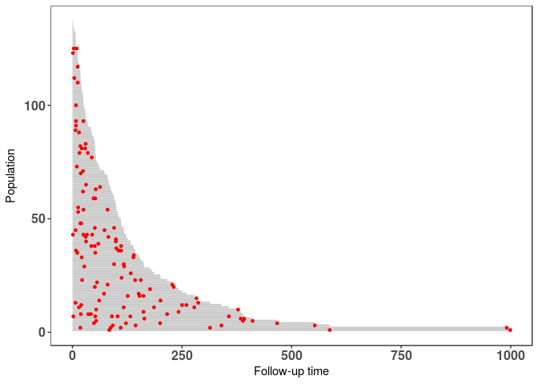
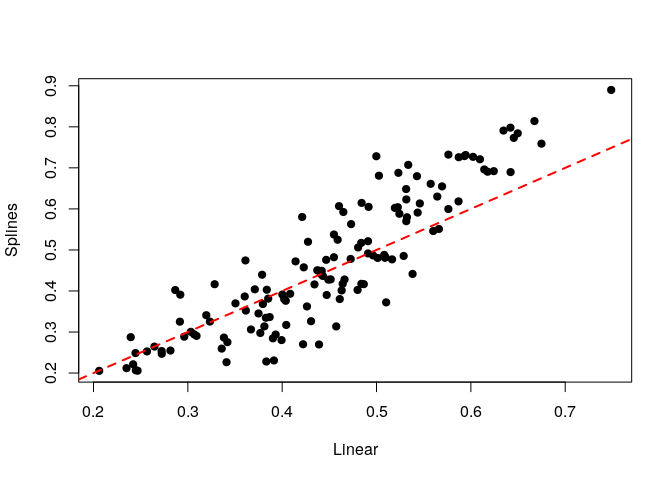
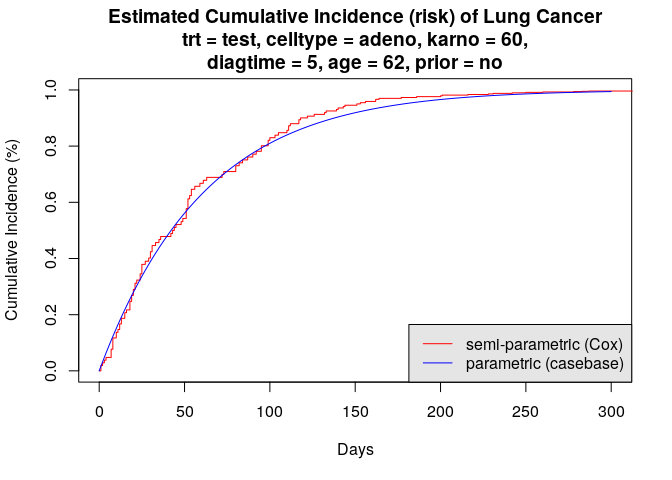

Methodological details
----------------------

Case-base sampling was proposed by [Hanley and Miettinen,
2009](https://github.com/sahirbhatnagar/casebase/blob/master/references/Hanley_Miettinen-2009-Inter_J_of_Biostats.pdf)
as a way to fit smooth-in-time parametric hazard functions via logistic
regression. The main idea, which was first proposed by Mantel, 1973 and
then later developped by Efron, 1977, is to sample person-moments, i.e.
discrete time points along an subject's follow-up time, in order to
construct a base series against which the case series can be compared.

This approach allows the explicit inclusion of the time variable into
the model, which enables the user to fit a wide class of parametric
hazard functions. For example, including time linearly recovers the
Gompertz hazard, whereas including time *logarithmically* recovers the
Weibull hazard; not including time at all corresponds to the exponential
hazard.

The theoretical properties of this approach have been studied in
[Saarela and Arjas,
2015](https://github.com/sahirbhatnagar/casebase/blob/master/references/Saarela_et_al-2015-Scandinavian_Journal_of_Statistics.pdf)
and [Saarela,
2015](https://github.com/sahirbhatnagar/casebase/blob/master/references/Saarela-2015-Lifetime_Data_Analysis.pdf).

First example
-------------

The first example we discuss uses the well-known `veteran` dataset,
which is part of the `survival` package. As we can see below, there is
almost no censoring, and therefore we can get a good visual
representation of the survival function:

``` {.r}
set.seed(12345)

library(survival)
data(veteran)
table(veteran$status)
```

    ## 
    ##   0   1 
    ##   9 128

``` {.r}
evtimes <- veteran$time[veteran$status == 1]
hist(evtimes, nclass = 30, main = '', xlab = 'Survival time (days)', 
     col = 'gray90', probability = TRUE)
tgrid <- seq(0, 1000, by = 10)
lines(tgrid, dexp(tgrid, rate = 1.0/mean(evtimes)), 
      lwd = 2, lty = 2, col = 'red')
```


As we can see, the empirical survival function ressembles an exponential
distribution.

We will first try to estimate the hazard function parametrically using
some well-known regression routines. But first, we will reformat the
data slightly.

``` {.r}
veteran$prior <- factor(veteran$prior, levels = c(0, 10), labels = c("no","yes"))
veteran$celltype <- factor(veteran$celltype, 
                           levels = c('large', 'squamous', 'smallcell', 'adeno'))
veteran$trt <- factor(veteran$trt, levels = c(1, 2), labels = c("standard", "test"))
```

Using the `eha` package, we can fit a Weibull form, with different
values of the shape parameter. For `shape = 1`, we get an exponential
distribution:

``` {.r}
pacman::p_load(eha)
y <- with(veteran, Surv(time, status))

model1 <- weibreg(y ~ karno + diagtime + age + prior + celltype + trt, 
                  data = veteran, shape = 1)
summary(model1)
```

    ## Call:
    ## weibreg(formula = y ~ karno + diagtime + age + prior + celltype + 
    ##     trt, data = veteran, shape = 1)
    ## 
    ## Covariate           Mean       Coef Exp(Coef)  se(Coef)    Wald p
    ## karno              68.419    -0.031     0.970     0.005     0.000 
    ## diagtime            8.139     0.000     1.000     0.009     0.974 
    ## age                57.379    -0.006     0.994     0.009     0.505 
    ## prior 
    ##               no    0.653     0         1           (reference)
    ##              yes    0.347     0.049     1.051     0.227     0.827 
    ## celltype 
    ##            large    0.269     0         1           (reference)
    ##         squamous    0.421    -0.377     0.686     0.273     0.166 
    ##        smallcell    0.206     0.443     1.557     0.261     0.090 
    ##            adeno    0.104     0.736     2.087     0.294     0.012 
    ## trt 
    ##         standard    0.477     0         1           (reference)
    ##             test    0.523     0.220     1.246     0.199     0.269 
    ## 
    ## log(scale)                    2.811    16.633     0.713     0.000 
    ## 
    ##  Shape is fixed at  1 
    ## 
    ## Events                    128 
    ## Total time at risk         16663 
    ## Max. log. likelihood      -716.16 
    ## LR test statistic         70.1 
    ## Degrees of freedom        8 
    ## Overall p-value           4.64229e-12

If we take `shape = 0`, the shape parameter is estimated along with the
regression coefficients:

``` {.r}
model2 <- weibreg(y ~ karno + diagtime + age + prior + celltype + trt, 
                  data = veteran, shape = 0)
summary(model2)
```

    ## Call:
    ## weibreg(formula = y ~ karno + diagtime + age + prior + celltype + 
    ##     trt, data = veteran, shape = 0)
    ## 
    ## Covariate           Mean       Coef Exp(Coef)  se(Coef)    Wald p
    ## karno              68.419    -0.032     0.968     0.005     0.000 
    ## diagtime            8.139     0.001     1.001     0.009     0.955 
    ## age                57.379    -0.007     0.993     0.009     0.476 
    ## prior 
    ##               no    0.653     0         1           (reference)
    ##              yes    0.347     0.047     1.048     0.229     0.836 
    ## celltype 
    ##            large    0.269     0         1           (reference)
    ##         squamous    0.421    -0.428     0.651     0.278     0.123 
    ##        smallcell    0.206     0.462     1.587     0.262     0.078 
    ##            adeno    0.104     0.792     2.208     0.300     0.008 
    ## trt 
    ##         standard    0.477     0         1           (reference)
    ##             test    0.523     0.246     1.279     0.203     0.224 
    ## 
    ## log(scale)                    2.864    17.537     0.671     0.000 
    ## log(shape)                    0.075     1.077     0.066     0.261 
    ## 
    ## Events                    128 
    ## Total time at risk         16663 
    ## Max. log. likelihood      -715.55 
    ## LR test statistic         65.1 
    ## Degrees of freedom        8 
    ## Overall p-value           4.65393e-11

Finally, we can also fit a Cox proportional hazard:

``` {.r}
model3 <- coxph(y ~ karno + diagtime + age + prior + celltype + trt, 
                data = veteran)
summary(model3)
```

    ## Call:
    ## coxph(formula = y ~ karno + diagtime + age + prior + celltype + 
    ##     trt, data = veteran)
    ## 
    ##   n= 137, number of events= 128 
    ## 
    ##                         coef  exp(coef)   se(coef)      z Pr(>|z|)    
    ## karno             -3.282e-02  9.677e-01  5.508e-03 -5.958 2.55e-09 ***
    ## diagtime           8.132e-05  1.000e+00  9.136e-03  0.009  0.99290    
    ## age               -8.706e-03  9.913e-01  9.300e-03 -0.936  0.34920    
    ## prioryes           7.159e-02  1.074e+00  2.323e-01  0.308  0.75794    
    ## celltypesquamous  -4.013e-01  6.695e-01  2.827e-01 -1.420  0.15574    
    ## celltypesmallcell  4.603e-01  1.584e+00  2.662e-01  1.729  0.08383 .  
    ## celltypeadeno      7.948e-01  2.214e+00  3.029e-01  2.624  0.00869 ** 
    ## trttest            2.946e-01  1.343e+00  2.075e-01  1.419  0.15577    
    ## ---
    ## Signif. codes:  0 '***' 0.001 '**' 0.01 '*' 0.05 '.' 0.1 ' ' 1
    ## 
    ##                   exp(coef) exp(-coef) lower .95 upper .95
    ## karno                0.9677     1.0334    0.9573    0.9782
    ## diagtime             1.0001     0.9999    0.9823    1.0182
    ## age                  0.9913     1.0087    0.9734    1.0096
    ## prioryes             1.0742     0.9309    0.6813    1.6937
    ## celltypesquamous     0.6695     1.4938    0.3847    1.1651
    ## celltypesmallcell    1.5845     0.6311    0.9403    2.6699
    ## celltypeadeno        2.2139     0.4517    1.2228    4.0084
    ## trttest              1.3426     0.7448    0.8939    2.0166
    ## 
    ## Concordance= 0.736  (se = 0.03 )
    ## Rsquare= 0.364   (max possible= 0.999 )
    ## Likelihood ratio test= 62.1  on 8 df,   p=1.799e-10
    ## Wald test            = 62.37  on 8 df,   p=1.596e-10
    ## Score (logrank) test = 66.74  on 8 df,   p=2.186e-11

As we can see, all three models are significant, and they give similar
information: `karno` and `celltype` are significant predictors, both
treatment is not.

The method available in this package makes use of *case-base sampling*.
That is, person-moments are randomly sampled across the entire follow-up
time, with some moments corresponding to cases and others to controls.
By sampling person-moments instead of individuals, we can then use
logistic regression to fit smooth-in-time parametric hazard functions.
See the previous section for more details.

First, we will look at the follow-up time by using population-time
plots:

``` {.r}
# create popTime object
pt_veteran <- casebase::popTime(data = veteran)
```

    ## 'time' will be used as the time variable

    ## 'status' will be used as the event variable

    ## Sampling from all remaining individuals under study,
    ##                     regardless of event status

``` {.r}
class(pt_veteran)
```

    ## [1] "popTime"    "data.table" "data.frame"

``` {.r}
# plot method for objects of class 'popTime'
plot(pt_veteran)
```



Population-time plots are a useful way of visualizing the total
follow-up experience, where individuals appear on the y-axis, and
follow-up time on the x-axis; each individual's follow-up time is
represented by a gray line segment. For convenience, we have ordered the
patients according to their time-to-event, and each event is represented
by a red dot. The censored observations (of which there is only a few)
correspond to the grey lines which do not end with a red dot.

Next, we use case-base sampling to fit a parametric hazard function via
logistic regression. First, we will include time as a linear term; as
noted above, this corresponds to an Gompertz hazard.

``` {.r}
library(casebase)
model4 <- fitSmoothHazard(status ~ time + karno + diagtime + age + prior +
             celltype + trt, data = veteran, ratio = 100)
```

    ## 'time' will be used as the time variable

``` {.r}
summary(model4)
```

    ## 
    ## Call:
    ## glm(formula = formula, family = binomial, data = sampleData)
    ## 
    ## Deviance Residuals: 
    ##     Min       1Q   Median       3Q      Max  
    ## -0.4288  -0.1499  -0.1199  -0.1003   3.4168  
    ## 
    ## Coefficients:
    ##                     Estimate Std. Error z value Pr(>|z|)    
    ## (Intercept)       -2.6999939  0.7215572  -3.742 0.000183 ***
    ## time               0.0003370  0.0006447   0.523 0.601203    
    ## karno             -0.0324184  0.0052921  -6.126 9.02e-10 ***
    ## diagtime           0.0036596  0.0093085   0.393 0.694214    
    ## age               -0.0064304  0.0092899  -0.692 0.488817    
    ## prioryes           0.0049789  0.2314208   0.022 0.982835    
    ## celltypesquamous  -0.4302885  0.2844478  -1.513 0.130352    
    ## celltypesmallcell  0.3947140  0.2626453   1.503 0.132880    
    ## celltypeadeno      0.7009165  0.2987905   2.346 0.018984 *  
    ## trttest            0.2101849  0.2017210   1.042 0.297431    
    ## ---
    ## Signif. codes:  0 '***' 0.001 '**' 0.01 '*' 0.05 '.' 0.1 ' ' 1
    ## 
    ## (Dispersion parameter for binomial family taken to be 1)
    ## 
    ##     Null deviance: 1436.2  on 12927  degrees of freedom
    ## Residual deviance: 1365.7  on 12918  degrees of freedom
    ## AIC: 1385.7
    ## 
    ## Number of Fisher Scoring iterations: 8

Since the output object from `fitSmoothHazard` inherits from the `glm`
class, we see a familiar result when using the function `summary`.

The main purpose of fitting smooth hazard functions is that it is then
relatively easy to compute absolute risks. For example, we can use the
function `absoluteRisk` to compute the mean absolute risk at 90 days,
which can then be compared to the empirical measure.

``` {.r}
absoluteRisk(object = model4, time = 90)
```

    ## [1] 0.5768982

``` {.r}
ftime <- veteran$time
mean(ftime <= 90)
```

    ## [1] 0.5547445

We can also fit a Weibull hazard by using a logarithmic term for time:

``` {.r}
model5 <- fitSmoothHazard(status ~ log(time) + karno + diagtime + age + prior +
             celltype + trt, data = veteran, ratio = 100)
```

    ## 'time' will be used as the time variable

``` {.r}
summary(model5)
```

    ## 
    ## Call:
    ## glm(formula = formula, family = binomial, data = sampleData)
    ## 
    ## Deviance Residuals: 
    ##     Min       1Q   Median       3Q      Max  
    ## -0.4603  -0.1521  -0.1192  -0.0971   3.4266  
    ## 
    ## Coefficients:
    ##                    Estimate Std. Error z value Pr(>|z|)    
    ## (Intercept)       -3.016737   0.759750  -3.971 7.17e-05 ***
    ## log(time)          0.069061   0.071970   0.960   0.3373    
    ## karno             -0.033136   0.005500  -6.024 1.70e-09 ***
    ## diagtime          -0.001473   0.009150  -0.161   0.8721    
    ## age               -0.004822   0.009307  -0.518   0.6044    
    ## prioryes           0.051890   0.229634   0.226   0.8212    
    ## celltypesquamous  -0.418226   0.279779  -1.495   0.1350    
    ## celltypesmallcell  0.448323   0.264064   1.698   0.0895 .  
    ## celltypeadeno      0.759124   0.303882   2.498   0.0125 *  
    ## trttest            0.264034   0.204881   1.289   0.1975    
    ## ---
    ## Signif. codes:  0 '***' 0.001 '**' 0.01 '*' 0.05 '.' 0.1 ' ' 1
    ## 
    ## (Dispersion parameter for binomial family taken to be 1)
    ## 
    ##     Null deviance: 1436.2  on 12927  degrees of freedom
    ## Residual deviance: 1364.9  on 12918  degrees of freedom
    ## AIC: 1384.9
    ## 
    ## Number of Fisher Scoring iterations: 8

With case-base sampling, it is straightforward to fit a semi-parametric
hazard function using splines, which can then be used to estimate the
mean absolute risk.

``` {.r}
# Fit a spline for time
library(splines)
model6 <- fitSmoothHazard(status ~ bs(time) + karno + diagtime + age + prior +
             celltype + trt, data = veteran, ratio = 100)
```

    ## 'time' will be used as the time variable

``` {.r}
summary(model6)
```

    ## 
    ## Call:
    ## glm(formula = formula, family = binomial, data = sampleData)
    ## 
    ## Deviance Residuals: 
    ##     Min       1Q   Median       3Q      Max  
    ## -0.4557  -0.1536  -0.1198  -0.0953   3.5215  
    ## 
    ## Coefficients:
    ##                     Estimate Std. Error z value Pr(>|z|)    
    ## (Intercept)       -2.9568779  0.7256358  -4.075 4.60e-05 ***
    ## bs(time)1          1.6434447  1.0344949   1.589  0.11214    
    ## bs(time)2         -2.5374842  1.7567675  -1.444  0.14863    
    ## bs(time)3          1.6957255  0.9856981   1.720  0.08537 .  
    ## karno             -0.0322233  0.0053581  -6.014 1.81e-09 ***
    ## diagtime           0.0006669  0.0091320   0.073  0.94178    
    ## age               -0.0063188  0.0093578  -0.675  0.49952    
    ## prioryes           0.0068816  0.2356245   0.029  0.97670    
    ## celltypesquamous  -0.3974461  0.2838466  -1.400  0.16145    
    ## celltypesmallcell  0.4656989  0.2648835   1.758  0.07873 .  
    ## celltypeadeno      0.8663980  0.3040303   2.850  0.00438 ** 
    ## trttest            0.2542601  0.2077276   1.224  0.22095    
    ## ---
    ## Signif. codes:  0 '***' 0.001 '**' 0.01 '*' 0.05 '.' 0.1 ' ' 1
    ## 
    ## (Dispersion parameter for binomial family taken to be 1)
    ## 
    ##     Null deviance: 1436.2  on 12927  degrees of freedom
    ## Residual deviance: 1362.9  on 12916  degrees of freedom
    ## AIC: 1386.9
    ## 
    ## Number of Fisher Scoring iterations: 8

``` {.r}
absoluteRisk(object = model6, time = 90)
```

    ## [1] 0.5744505

As we can see from the summary, there is little evidence that splines
actually improve the fit. Moreover, we can see that estimated individual
absolute risks are essentially the same when using either a linear term
or splines:

``` {.r}
linearRisk <- absoluteRisk(object = model4, time = 90, newdata = veteran)
splineRisk <- absoluteRisk(object = model6, time = 90, newdata = veteran)

plot(linearRisk, splineRisk,
     xlab = "Linear", ylab = "Splines", pch = 19)
abline(a = 0, b = 1, lty = 2, lwd = 2, col = 'red')
```



These last three models give similar information as the first three,
i.e. the main predictors for the hazard are `karno` and `celltype`, with
treatment being non-significant. Moreover, by explicitely including the
time variable in the formula, we see that it is not significant; this is
evidence that the true hazard is exponential.

Finally, we can look at the estimates of the coefficients for the Cox
model, as well as the last three models (CB stands for "case-base"):

<table>
<thead>
<tr>
<th style="text-align:left;">
</th>
<th style="text-align:right;">
Cox model
</th>
<th style="text-align:right;">
CB linear
</th>
<th style="text-align:right;">
CB log-linear
</th>
<th style="text-align:right;">
CB splines
</th>
</tr>
</thead>
<tbody>
<tr>
<td style="text-align:left;">
karno
</td>
<td style="text-align:right;">
-0.0328
</td>
<td style="text-align:right;">
-0.0324
</td>
<td style="text-align:right;">
-0.0331
</td>
<td style="text-align:right;">
-0.0322
</td>
</tr>
<tr>
<td style="text-align:left;">
diagtime
</td>
<td style="text-align:right;">
0.0001
</td>
<td style="text-align:right;">
0.0037
</td>
<td style="text-align:right;">
-0.0015
</td>
<td style="text-align:right;">
0.0007
</td>
</tr>
<tr>
<td style="text-align:left;">
age
</td>
<td style="text-align:right;">
-0.0087
</td>
<td style="text-align:right;">
-0.0064
</td>
<td style="text-align:right;">
-0.0048
</td>
<td style="text-align:right;">
-0.0063
</td>
</tr>
<tr>
<td style="text-align:left;">
prioryes
</td>
<td style="text-align:right;">
0.0716
</td>
<td style="text-align:right;">
0.0050
</td>
<td style="text-align:right;">
0.0519
</td>
<td style="text-align:right;">
0.0069
</td>
</tr>
<tr>
<td style="text-align:left;">
celltypesquamous
</td>
<td style="text-align:right;">
-0.4013
</td>
<td style="text-align:right;">
-0.4303
</td>
<td style="text-align:right;">
-0.4182
</td>
<td style="text-align:right;">
-0.3974
</td>
</tr>
<tr>
<td style="text-align:left;">
celltypesmallcell
</td>
<td style="text-align:right;">
0.4603
</td>
<td style="text-align:right;">
0.3947
</td>
<td style="text-align:right;">
0.4483
</td>
<td style="text-align:right;">
0.4657
</td>
</tr>
<tr>
<td style="text-align:left;">
celltypeadeno
</td>
<td style="text-align:right;">
0.7948
</td>
<td style="text-align:right;">
0.7009
</td>
<td style="text-align:right;">
0.7591
</td>
<td style="text-align:right;">
0.8664
</td>
</tr>
<tr>
<td style="text-align:left;">
trttest
</td>
<td style="text-align:right;">
0.2946
</td>
<td style="text-align:right;">
0.2102
</td>
<td style="text-align:right;">
0.2640
</td>
<td style="text-align:right;">
0.2543
</td>
</tr>
</tbody>
</table>
Cumulative Incidence Curves
---------------------------

Here we show how to calculate the cumulative incidence curves for a
specific risk profile using the following equation:

$$ CI(x, t) = 1 - exp\left[ - \int_0^t h(x, u) \textrm{d}u \right] $$
where \\( h(x, t) \\) is the hazard function, \\( t \\) denotes the
numerical value (number of units) of a point in prognostic/prospective
time and \\( x \\) is the realization of the vector \\( X \\) of
variates based on the patient's profile and intervention (if any).

We compare the cumulative incidence functions from the fully-parametric
fit using case base sampling, with those from the Cox model:

``` {.r}
# define a specific covariate profile
new_data <- data.frame(trt = "test", 
                       celltype = "adeno", 
                       karno = median(veteran$karno), 
                       diagtime = median(veteran$diagtime),
                       age = median(veteran$age),
                       prior = "no")

# calculate cumulative incidence using casebase model
smooth_risk <- absoluteRisk(object = model4, time = seq(0,300, 1), 
                            newdata = new_data)

# cumulative incidence function for the Cox model
plot(survfit(model3, newdata=new_data),
     xlab = "Days", ylab="Cumulative Incidence (%)", fun = "event",
     xlim = c(0,300), conf.int = F, col = "red", 
     main = sprintf("Estimated Cumulative Incidence (risk) of Lung Cancer\ntrt = test, celltype = adeno, karno = %g,\ndiagtime = %g, age = %g, prior = no", median(veteran$karno), median(veteran$diagtime), 
                    median(veteran$age)))

# add casebase curve with legend
lines(seq(0,300, 1), smooth_risk[1,], type = "l", col = "blue")
legend("bottomright", 
       legend = c("semi-parametric (Cox)", "parametric (casebase)"), 
       col = c("red","blue"),
       lty = c(1, 1), 
       bg = "gray90")
```



Session information
-------------------

    ## R version 3.3.1 (2016-06-21)
    ## Platform: x86_64-pc-linux-gnu (64-bit)
    ## Running under: Ubuntu 16.10
    ## 
    ## attached base packages:
    ## [1] splines   stats     graphics  grDevices utils     datasets  methods  
    ## [8] base     
    ## 
    ## other attached packages:
    ## [1] casebase_0.1.0  eha_2.4-4       survival_2.39-5
    ## 
    ## loaded via a namespace (and not attached):
    ##  [1] Rcpp_0.12.9      knitr_1.15.1     magrittr_1.5     munsell_0.4.3   
    ##  [5] colorspace_1.3-1 lattice_0.20-33  highr_0.6        plyr_1.8.4      
    ##  [9] stringr_1.2.0    tools_3.3.1      grid_3.3.1       data.table_1.9.6
    ## [13] gtable_0.2.0     pacman_0.4.1     htmltools_0.3.5  assertthat_0.1  
    ## [17] lazyeval_0.2.0   yaml_2.1.14      rprojroot_1.2    digest_0.6.12   
    ## [21] tibble_1.2       Matrix_1.2-6     ggplot2_2.2.0    VGAM_1.0-2      
    ## [25] evaluate_0.10    rmarkdown_1.3    labeling_0.3     stringi_1.1.2   
    ## [29] scales_0.4.1     backports_1.0.5  stats4_3.3.1     chron_2.3-47
