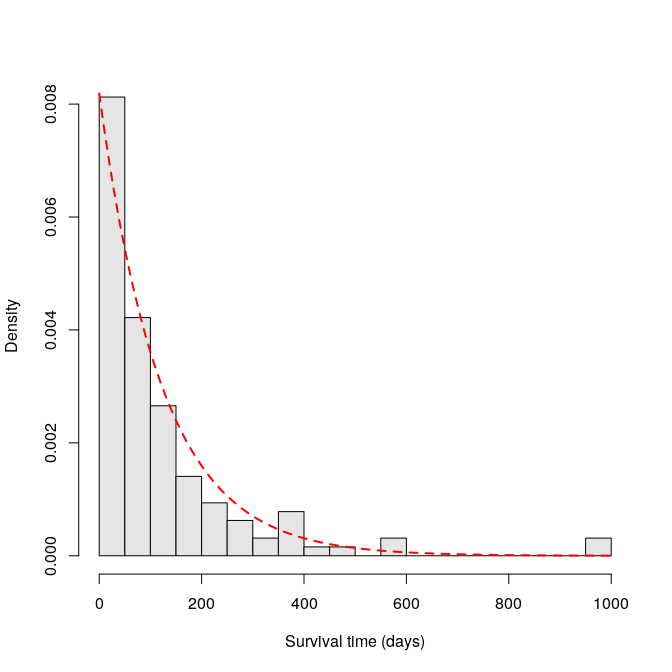
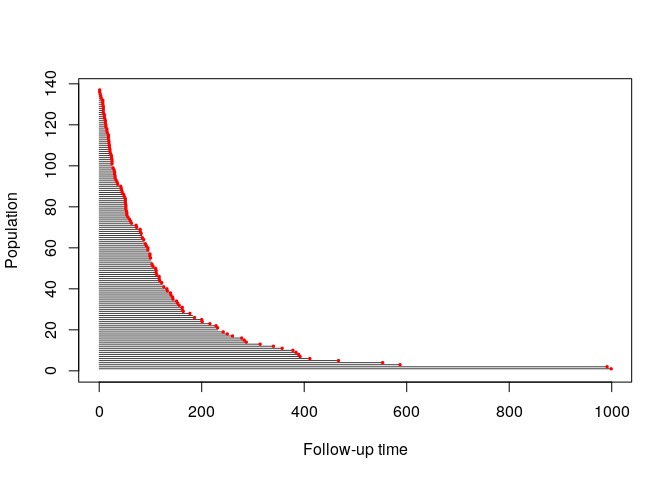
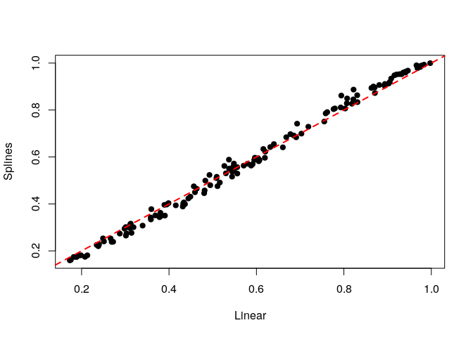

Methodological details
----------------------

Case-base sampling was proposed by Hanley & Miettinen \[-@hanley2009fitting\] as a way to fit smooth-in-time parametric hazard functions via logistic regression. The main idea, which was first proposed by Mantel \[-@mantel1973synthetic\] and then later developped by Efron \[-@efron1977efficiency\], is to sample person-moments, i.e. discrete time points along an subject's follow-up time, in order to construct a base series against which the case series can be compared.

This approach allows the explicit inclusion of the time variable into the model, which enables the user to fit a wide class of parametric hazard functions. For example, including time linearly recovers the Gompertz hazard, whereas including time *logarithmically* recovers the Weibull hazard; not including time at all corresponds to the exponential hazard.

The theoretical properties of this approach have been studied in Saarela & Arjas \[-@saarela2015non\] and Saarela \[-@saarela2015case\].

First example
-------------

The first example we discuss uses the well-known `veteran` dataset, which is part of the `survival` package. As we can see below, there is almost no censoring, and therefore we can get a good visual representation of the survival function:

``` r
library(survival)
data(veteran)
table(veteran$status)
```

    ## 
    ##   0   1 
    ##   9 128

``` r
evtimes <- veteran$time[veteran$status == 1]
hist(evtimes, nclass = 30, main = '', xlab = 'Survival time (days)', 
     col = 'gray90', probability = TRUE)
tgrid <- seq(0, 1000, by = 10)
lines(tgrid, dexp(tgrid, rate = 1.0/mean(evtimes)), 
      lwd = 2, lty = 2, col = 'red')
```



As we can see, the empirical survival function ressembles an exponential distribution.

We will first try to estimate the hazard function parametrically using some well-known regression routines. But first, we will reformat the data slightly.

``` r
veteran$prior <- factor(veteran$prior, levels = c(0, 10))
veteran$celltype <- factor(veteran$celltype, 
                           levels = c('large', 'squamous', 'smallcell', 'adeno'))
veteran$trt <- factor(veteran$trt, levels = c(1, 2))
```

Using the `eha` package, we can fit a Weibull form, with different values of the shape parameter. For `shape = 1`, we get an exponential distribution:

``` r
pacman::p_load(eha)
y <- with(veteran, Surv(time, status))

model1 <- weibreg(y ~ karno + diagtime + age + prior + celltype + trt, 
                  data = veteran, shape = 1)
summary(model1)
```

    ## Call:
    ## weibreg(formula = y ~ karno + diagtime + age + prior + celltype + 
    ##     trt, data = veteran, shape = 1)
    ## 
    ## Covariate           Mean       Coef Exp(Coef)  se(Coef)    Wald p
    ## karno              68.419    -0.031     0.970     0.005     0.000 
    ## diagtime            8.139     0.000     1.000     0.009     0.974 
    ## age                57.379    -0.006     0.994     0.009     0.505 
    ## prior 
    ##                0    0.653     0         1           (reference)
    ##               10    0.347     0.049     1.051     0.227     0.827 
    ## celltype 
    ##            large    0.269     0         1           (reference)
    ##         squamous    0.421    -0.377     0.686     0.273     0.166 
    ##        smallcell    0.206     0.443     1.557     0.261     0.090 
    ##            adeno    0.104     0.736     2.087     0.294     0.012 
    ## trt 
    ##                1    0.477     0         1           (reference)
    ##                2    0.523     0.220     1.246     0.199     0.269 
    ## 
    ## log(scale)                    2.811    16.633     0.713     0.000 
    ## 
    ##  Shape is fixed at  1 
    ## 
    ## Events                    128 
    ## Total time at risk         16663 
    ## Max. log. likelihood      -716.16 
    ## LR test statistic         70.1 
    ## Degrees of freedom        8 
    ## Overall p-value           4.64229e-12

If we take `shape = 0`, the shape parameter is estimated along with the regression coefficients:

``` r
model2 <- weibreg(y ~ karno + diagtime + age + prior + celltype + trt, 
                  data = veteran, shape = 0)
summary(model2)
```

    ## Call:
    ## weibreg(formula = y ~ karno + diagtime + age + prior + celltype + 
    ##     trt, data = veteran, shape = 0)
    ## 
    ## Covariate           Mean       Coef Exp(Coef)  se(Coef)    Wald p
    ## karno              68.419    -0.032     0.968     0.005     0.000 
    ## diagtime            8.139     0.001     1.001     0.009     0.955 
    ## age                57.379    -0.007     0.993     0.009     0.476 
    ## prior 
    ##                0    0.653     0         1           (reference)
    ##               10    0.347     0.047     1.048     0.229     0.836 
    ## celltype 
    ##            large    0.269     0         1           (reference)
    ##         squamous    0.421    -0.428     0.651     0.278     0.123 
    ##        smallcell    0.206     0.462     1.587     0.262     0.078 
    ##            adeno    0.104     0.792     2.208     0.300     0.008 
    ## trt 
    ##                1    0.477     0         1           (reference)
    ##                2    0.523     0.246     1.279     0.203     0.224 
    ## 
    ## log(scale)                    2.864    17.537     0.671     0.000 
    ## log(shape)                    0.075     1.077     0.066     0.261 
    ## 
    ## Events                    128 
    ## Total time at risk         16663 
    ## Max. log. likelihood      -715.55 
    ## LR test statistic         65.1 
    ## Degrees of freedom        8 
    ## Overall p-value           4.65393e-11

Finally, we can also fit a Cox proportional hazard:

``` r
model3 <- coxph(y ~ karno + diagtime + age + prior + celltype + trt, 
                data = veteran)
summary(model3)
```

    ## Call:
    ## coxph(formula = y ~ karno + diagtime + age + prior + celltype + 
    ##     trt, data = veteran)
    ## 
    ##   n= 137, number of events= 128 
    ## 
    ##                         coef  exp(coef)   se(coef)      z Pr(>|z|)    
    ## karno             -3.282e-02  9.677e-01  5.508e-03 -5.958 2.55e-09 ***
    ## diagtime           8.132e-05  1.000e+00  9.136e-03  0.009  0.99290    
    ## age               -8.706e-03  9.913e-01  9.300e-03 -0.936  0.34920    
    ## prior10            7.159e-02  1.074e+00  2.323e-01  0.308  0.75794    
    ## celltypesquamous  -4.013e-01  6.695e-01  2.827e-01 -1.420  0.15574    
    ## celltypesmallcell  4.603e-01  1.584e+00  2.662e-01  1.729  0.08383 .  
    ## celltypeadeno      7.948e-01  2.214e+00  3.029e-01  2.624  0.00869 ** 
    ## trt2               2.946e-01  1.343e+00  2.075e-01  1.419  0.15577    
    ## ---
    ## Signif. codes:  0 '***' 0.001 '**' 0.01 '*' 0.05 '.' 0.1 ' ' 1
    ## 
    ##                   exp(coef) exp(-coef) lower .95 upper .95
    ## karno                0.9677     1.0334    0.9573    0.9782
    ## diagtime             1.0001     0.9999    0.9823    1.0182
    ## age                  0.9913     1.0087    0.9734    1.0096
    ## prior10              1.0742     0.9309    0.6813    1.6937
    ## celltypesquamous     0.6695     1.4938    0.3847    1.1651
    ## celltypesmallcell    1.5845     0.6311    0.9403    2.6699
    ## celltypeadeno        2.2139     0.4517    1.2228    4.0084
    ## trt2                 1.3426     0.7448    0.8939    2.0166
    ## 
    ## Concordance= 0.736  (se = 0.03 )
    ## Rsquare= 0.364   (max possible= 0.999 )
    ## Likelihood ratio test= 62.1  on 8 df,   p=1.799e-10
    ## Wald test            = 62.37  on 8 df,   p=1.596e-10
    ## Score (logrank) test = 66.74  on 8 df,   p=2.186e-11

As we can see, all three models are significant, and they give similar information: `karno` and `celltype` are significant predictors, both treatment is not.

The method available in this package makes use of *case-base sampling*. That is, person-moments are randomly sampled across the entire follow-up time, with some moments corresponding to cases and others to controls. By sampling person-moments instead of individuals, we can then use logistic regression to fit smooth-in-time parametric hazard functions. See the previous section for more details.

First, we will look at the follow-up time by using population-time plots:

``` r
nobs <- nrow(y)
ftime <- veteran$time
ord <- order(ftime, decreasing = TRUE)
plot(0, type = 'n', xlim = c(0, max(ftime)), ylim = c(0, nobs), 
     xlab = 'Follow-up time', ylab = 'Population')
segments(rep(0.0, nobs), 1:nobs, ftime[ord], 1:nobs, col = 'gray25')
cases <- veteran$status == 1
points((ftime[ord])[cases[ord]], (1:nobs)[cases[ord]], pch = 20, col = 'red', cex = 0.5)
```



Population-time plots are a useful way of visualizing the total follow-up experience, where individuals appear on the y-axis, and follow-up time on the x-axis; each individual's follow-up time is represented by a gray line segment. For convenience, we have ordered the patients according to their time-to-event, and each event is represented by a red dot. The censored observations (of which there is only a few) correspond to the grey lines which do not end with a red dot.

Next, we use case-base sampling to fit a parametric hazard function via logistic regression. First, we will include time as a linear term; as noted above, this corresponds to an Gompertz hazard.

``` r
library(casebase)
model4 <- fitSmoothHazard(status ~ time + karno + diagtime + age + prior +
             celltype + trt, data = veteran, ratio = 100, type = "uniform")
```

    ## 'time' will be used as the time variable

``` r
summary(model4)
```

    ## 
    ## Call:
    ## glm(formula = formula, family = binomial, data = sampleData)
    ## 
    ## Deviance Residuals: 
    ##     Min       1Q   Median       3Q      Max  
    ## -0.4446  -0.1505  -0.1197  -0.0986   3.4172  
    ## 
    ## Coefficients:
    ##                     Estimate Std. Error z value Pr(>|z|)    
    ## (Intercept)       -2.8670224  0.7116424  -4.029 5.61e-05 ***
    ## time               0.0003465  0.0006494   0.534  0.59361    
    ## karno             -0.0321467  0.0052818  -6.086 1.15e-09 ***
    ## diagtime           0.0005638  0.0092514   0.061  0.95141    
    ## age               -0.0042352  0.0093863  -0.451  0.65184    
    ## prior10            0.0804793  0.2335061   0.345  0.73035    
    ## celltypesquamous  -0.4130992  0.2841325  -1.454  0.14598    
    ## celltypesmallcell  0.4297525  0.2636311   1.630  0.10307    
    ## celltypeadeno      0.7845810  0.2968491   2.643  0.00822 ** 
    ## trt2               0.2005978  0.1986860   1.010  0.31268    
    ## ---
    ## Signif. codes:  0 '***' 0.001 '**' 0.01 '*' 0.05 '.' 0.1 ' ' 1
    ## 
    ## (Dispersion parameter for binomial family taken to be 1)
    ## 
    ##     Null deviance: 1436.2  on 12927  degrees of freedom
    ## Residual deviance: 1365.4  on 12918  degrees of freedom
    ## AIC: 1385.4
    ## 
    ## Number of Fisher Scoring iterations: 8

Since the output object from `fitSmoothHazard` inherits from the `glm` class, we see a familiar result when using the function `summary`.

The main purpose of fitting smooth hazard functions is that it is then relatively easy to compute absolute risks. For example, we can use the function `absoluteRisk` to compute the mean absolute risk at 90 days, which can then be compared to the empirical measure.

``` r
absoluteRisk(object = model4, time = 90)
```

    ## [1] 0.5769655

``` r
mean(ftime <= 90)
```

    ## [1] 0.5547445

We can also fit a Weibull hazard by using a logarithmic term for time:

``` r
model5 <- fitSmoothHazard(status ~ log(time) + karno + diagtime + age + prior +
             celltype + trt, data = veteran, ratio = 100, type = "uniform")
```

    ## 'time' will be used as the time variable

``` r
summary(model5)
```

    ## 
    ## Call:
    ## glm(formula = formula, family = binomial, data = sampleData)
    ## 
    ## Deviance Residuals: 
    ##     Min       1Q   Median       3Q      Max  
    ## -0.4488  -0.1514  -0.1200  -0.0965   3.4111  
    ## 
    ## Coefficients:
    ##                    Estimate Std. Error z value Pr(>|z|)    
    ## (Intercept)       -3.027972   0.751706  -4.028 5.62e-05 ***
    ## log(time)          0.084456   0.073074   1.156  0.24778    
    ## karno             -0.032782   0.005481  -5.982 2.21e-09 ***
    ## diagtime           0.001580   0.009269   0.170  0.86463    
    ## age               -0.006733   0.009322  -0.722  0.47010    
    ## prior10            0.051777   0.230722   0.224  0.82244    
    ## celltypesquamous  -0.413111   0.277822  -1.487  0.13703    
    ## celltypesmallcell  0.464346   0.264065   1.758  0.07867 .  
    ## celltypeadeno      0.815158   0.301082   2.707  0.00678 ** 
    ## trt2               0.244825   0.203568   1.203  0.22911    
    ## ---
    ## Signif. codes:  0 '***' 0.001 '**' 0.01 '*' 0.05 '.' 0.1 ' ' 1
    ## 
    ## (Dispersion parameter for binomial family taken to be 1)
    ## 
    ##     Null deviance: 1436.2  on 12927  degrees of freedom
    ## Residual deviance: 1365.9  on 12918  degrees of freedom
    ## AIC: 1385.9
    ## 
    ## Number of Fisher Scoring iterations: 8

With case-base sampling, it is straightforward to fit a semi-parametric hazard function using splines, which can then be used to estimate the mean absolute risk.

``` r
# Fit a spline for time
library(splines)
model6 <- fitSmoothHazard(status ~ bs(time) + karno + diagtime + age + prior +
             celltype + trt, data = veteran, ratio = 100, type = "uniform")
```

    ## 'time' will be used as the time variable

``` r
summary(model6)
```

    ## 
    ## Call:
    ## glm(formula = formula, family = binomial, data = sampleData)
    ## 
    ## Deviance Residuals: 
    ##     Min       1Q   Median       3Q      Max  
    ## -0.4648  -0.1526  -0.1180  -0.0954   3.5360  
    ## 
    ## Coefficients:
    ##                     Estimate Std. Error z value Pr(>|z|)    
    ## (Intercept)       -2.8302890  0.7228096  -3.916 9.02e-05 ***
    ## bs(time)1          1.5464156  1.0182790   1.519   0.1288    
    ## bs(time)2         -2.4865426  1.7866239  -1.392   0.1640    
    ## bs(time)3          1.7587993  1.0226292   1.720   0.0855 .  
    ## karno             -0.0338202  0.0054661  -6.187 6.12e-10 ***
    ## diagtime           0.0006984  0.0092893   0.075   0.9401    
    ## age               -0.0067778  0.0093565  -0.724   0.4688    
    ## prior10            0.0583465  0.2353199   0.248   0.8042    
    ## celltypesquamous  -0.4175652  0.2836135  -1.472   0.1409    
    ## celltypesmallcell  0.4702381  0.2652270   1.773   0.0762 .  
    ## celltypeadeno      0.8112066  0.3044052   2.665   0.0077 ** 
    ## trt2               0.2840322  0.2067615   1.374   0.1695    
    ## ---
    ## Signif. codes:  0 '***' 0.001 '**' 0.01 '*' 0.05 '.' 0.1 ' ' 1
    ## 
    ## (Dispersion parameter for binomial family taken to be 1)
    ## 
    ##     Null deviance: 1436.2  on 12927  degrees of freedom
    ## Residual deviance: 1360.8  on 12916  degrees of freedom
    ## AIC: 1384.8
    ## 
    ## Number of Fisher Scoring iterations: 8

``` r
absoluteRisk(object = model6, time = 90)
```

    ## [1] 0.5752517

As we can see from the summary, there is little evidence that splines actually improve the fit. Moreover, we can see that estimated individual absolute risks are essentially the same when using either a linear term or splines:

``` r
linearRisk <- absoluteRisk(object = model4, time = 90, newdata = veteran)
splineRisk <- absoluteRisk(object = model6, time = 90, newdata = veteran)

plot(linearRisk, splineRisk,
     xlab = "Linear", ylab = "Splines", pch = 19)
abline(a = 0, b = 1, lty = 2, lwd = 2, col = 'red')
```



These last three models give similar information as the first three, i.e. the main predictors for the hazard are `karno` and `celltype`, with treatment being non-significant. Moreover, by explicitely including the time variable in the formula, we see that it is not significant; this is evidence that the true hazard is exponential.

Finally, we can look at the estimates of the coefficients for the Cox model, as well as the last three models (CB stands for "case-base"):

<table>
<thead>
<tr>
<th style="text-align:left;">
</th>
<th style="text-align:right;">
Cox model
</th>
<th style="text-align:right;">
CB linear
</th>
<th style="text-align:right;">
CB log-linear
</th>
<th style="text-align:right;">
CB splines
</th>
</tr>
</thead>
<tbody>
<tr>
<td style="text-align:left;">
karno
</td>
<td style="text-align:right;">
-0.0328
</td>
<td style="text-align:right;">
-0.0321
</td>
<td style="text-align:right;">
-0.0328
</td>
<td style="text-align:right;">
-0.0338
</td>
</tr>
<tr>
<td style="text-align:left;">
diagtime
</td>
<td style="text-align:right;">
0.0001
</td>
<td style="text-align:right;">
0.0006
</td>
<td style="text-align:right;">
0.0016
</td>
<td style="text-align:right;">
0.0007
</td>
</tr>
<tr>
<td style="text-align:left;">
age
</td>
<td style="text-align:right;">
-0.0087
</td>
<td style="text-align:right;">
-0.0042
</td>
<td style="text-align:right;">
-0.0067
</td>
<td style="text-align:right;">
-0.0068
</td>
</tr>
<tr>
<td style="text-align:left;">
prior10
</td>
<td style="text-align:right;">
0.0716
</td>
<td style="text-align:right;">
0.0805
</td>
<td style="text-align:right;">
0.0518
</td>
<td style="text-align:right;">
0.0583
</td>
</tr>
<tr>
<td style="text-align:left;">
celltypesquamous
</td>
<td style="text-align:right;">
-0.4013
</td>
<td style="text-align:right;">
-0.4131
</td>
<td style="text-align:right;">
-0.4131
</td>
<td style="text-align:right;">
-0.4176
</td>
</tr>
<tr>
<td style="text-align:left;">
celltypesmallcell
</td>
<td style="text-align:right;">
0.4603
</td>
<td style="text-align:right;">
0.4298
</td>
<td style="text-align:right;">
0.4643
</td>
<td style="text-align:right;">
0.4702
</td>
</tr>
<tr>
<td style="text-align:left;">
celltypeadeno
</td>
<td style="text-align:right;">
0.7948
</td>
<td style="text-align:right;">
0.7846
</td>
<td style="text-align:right;">
0.8152
</td>
<td style="text-align:right;">
0.8112
</td>
</tr>
<tr>
<td style="text-align:left;">
trt2
</td>
<td style="text-align:right;">
0.2946
</td>
<td style="text-align:right;">
0.2006
</td>
<td style="text-align:right;">
0.2448
</td>
<td style="text-align:right;">
0.2840
</td>
</tr>
</tbody>
</table>
Session information
-------------------

    ## R version 3.3.1 (2016-06-21)
    ## Platform: x86_64-pc-linux-gnu (64-bit)
    ## Running under: Ubuntu 16.10
    ## 
    ## attached base packages:
    ## [1] splines   stats     graphics  grDevices utils     datasets  methods  
    ## [8] base     
    ## 
    ## other attached packages:
    ## [1] casebase_0.1.0  eha_2.4-4       survival_2.39-5
    ## 
    ## loaded via a namespace (and not attached):
    ##  [1] Rcpp_0.12.9      knitr_1.15.1     magrittr_1.5     munsell_0.4.3   
    ##  [5] colorspace_1.3-1 lattice_0.20-33  highr_0.6        plyr_1.8.4      
    ##  [9] stringr_1.2.0    tools_3.3.1      grid_3.3.1       data.table_1.9.6
    ## [13] gtable_0.2.0     pacman_0.4.1     htmltools_0.3.5  assertthat_0.1  
    ## [17] lazyeval_0.2.0   yaml_2.1.14      rprojroot_1.2    digest_0.6.12   
    ## [21] tibble_1.2       Matrix_1.2-6     ggplot2_2.2.0    VGAM_1.0-2      
    ## [25] evaluate_0.10    rmarkdown_1.3    stringi_1.1.2    scales_0.4.1    
    ## [29] backports_1.0.5  stats4_3.3.1     chron_2.3-47

References
----------
