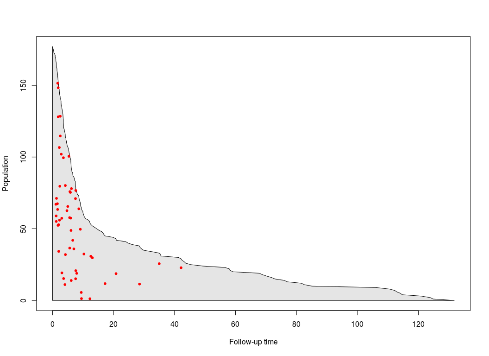
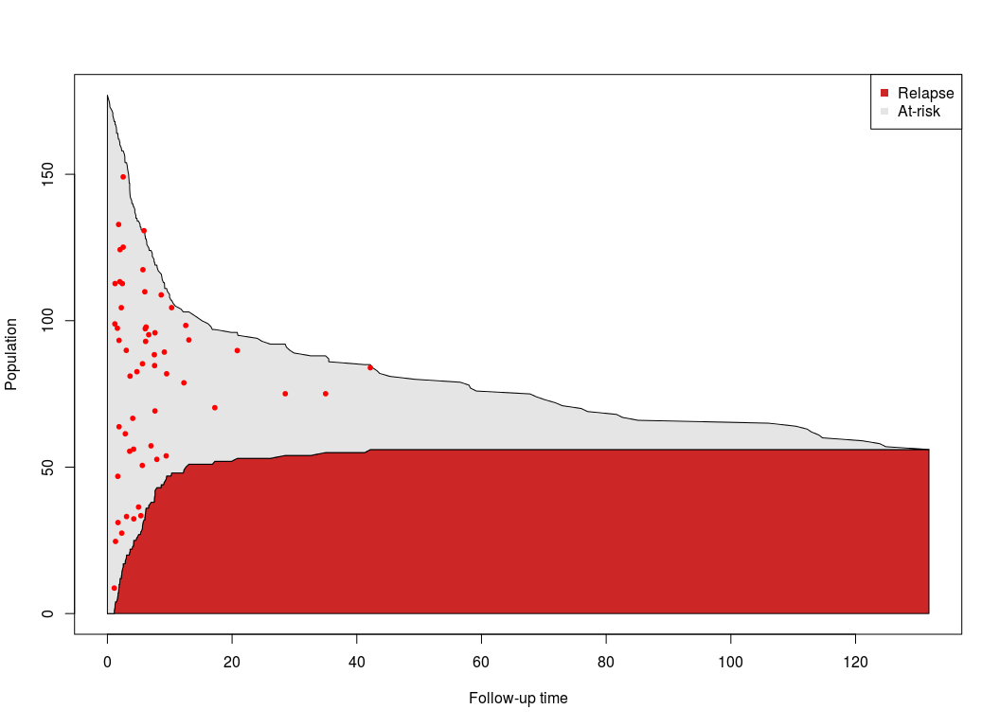
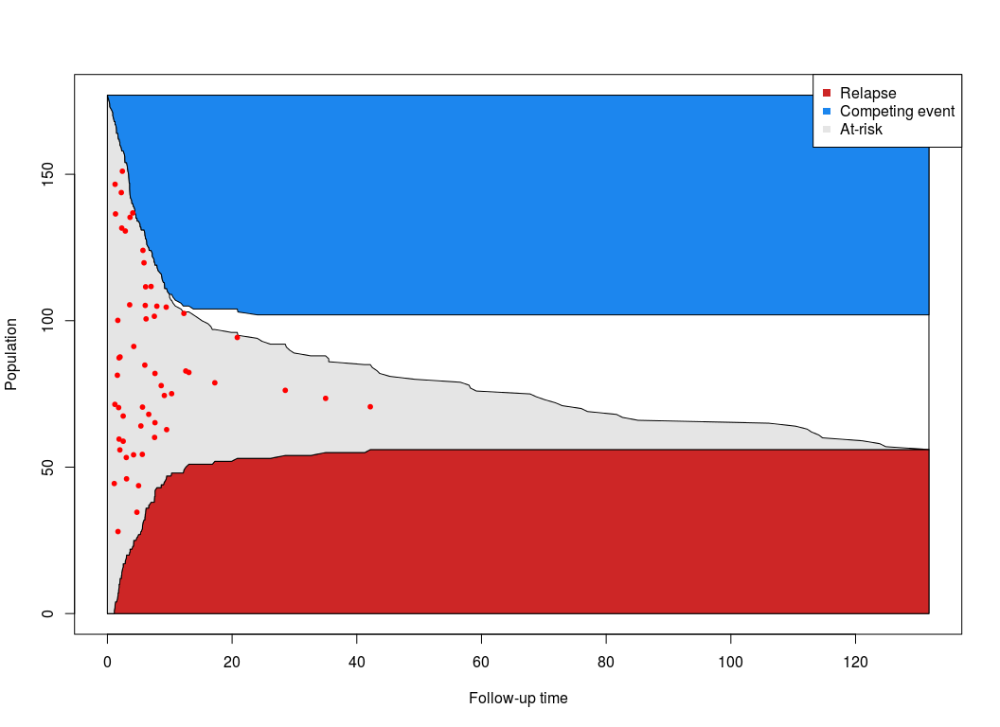
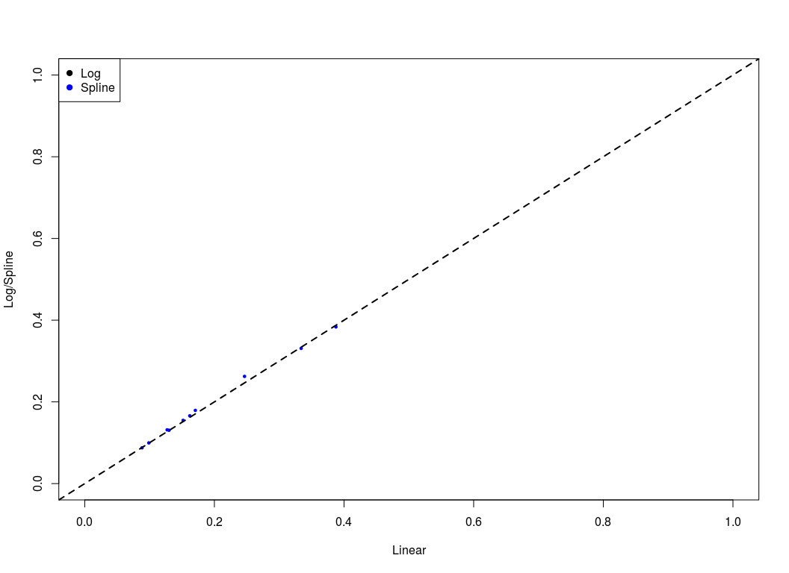

# Competing risk analysis using case-base sampling
Maxime Turgeon  
`r Sys.Date()`  

## Data

We will use the same data that was used in Scrucca *et al* [-@scrucca2010regression]. The data is available on the main author's [website](http://www.stat.unipg.it/luca/R/).


```r
DT <- read.csv(system.file("extdata", "bmtcrr.csv", package = "casebase"))
head(DT)
```

```
##   Sex   D   Phase Age Status Source  ftime
## 1   M ALL Relapse  48      2  BM+PB   0.67
## 2   F AML     CR2  23      1  BM+PB   9.50
## 3   M ALL     CR3   7      0  BM+PB 131.77
## 4   F ALL     CR2  26      2  BM+PB  24.03
## 5   F ALL     CR2  36      2  BM+PB   1.47
## 6   M ALL Relapse  17      2  BM+PB   2.23
```

We will perform a competing risk analysis on data from 177 patients who received a stem cell transplant for acute leukemia. The event of interest in relapse, but other competing causes (e.g. transplant-related death) need to be taken into account. We also want to take into account the effect of several covariates such as Sex, Disease (lymphoblastic or myeloblastic leukemia, abbreviated as ALL and AML, respectively), Phase at transplant (Relapse, CR1, CR2, CR3), Source of stem cells (bone marrow and peripheral blood, coded as BM+PB, or peripheral blood, coded as PB), and Age. Below, we reproduce their Table 1:

| Variable | Description            | Statistical summary    |
| -------- | ---------------------- | ---------------------- |
| Sex      | Sex                    | M=Male (100) <br> F=Female (77) |
| D        | Disease                | ALL (73) <br> AML (104) |
| Phase    | Phase                  | CR1 (47) <br> CR2 (45) <br> CR3 (12) <br> Relapse (73) |
| Source   | Type of transplant     | BM+PB (21) <br> PB (156) |
| Age      | Age of patient (years) | 4–62 <br> 30.47 (13.04) |
| Ftime    | Failure time (months)  | 0.13–131.77 <br> 20.28 (30.78) |
| Status   | Status indicator       | 0=censored (46) <br> 1=relapse (56) <br> 2=competing event (75) |

The statistical summary is generated differently for continuous and categorical variables: 

 - For continuous variables, we are given the range, followed by the mean and standard deviation.
 
 - For categorical variables, we are given the counts for each category.
 
Note that failure time can also correspond to censoring.

## Population-time plots

In order to try and visualize the incidence density of relapse, we can look at a population-time plot: on the X-axis we have time, and on the Y-axis we have the size of the risk set at a particular time point. Failure times associated to the event of interest can then be highlighted on the plot using red dots.


```r
nobs <- nrow(DT)
ftime <- DT$ftime
ord <- order(ftime, decreasing=FALSE)

# We split the person-moments in four categories:
# 1) at-risk
# 2) main event
# 3) competing event
# 4) censored
yCoords <- cbind(cumsum(DT[ord, "Status"] == 2), 
                 cumsum(DT[ord, "Status"] == 1),
                 cumsum(DT[ord, "Status"] == 0))
yCoords <- cbind(yCoords, nobs - rowSums(yCoords))

# Plot only at-risk
plot(0, type='n', xlim=c(0, max(ftime)), ylim=c(0, nobs), 
     xlab='Follow-up time', ylab='Population')
polygon(c(0, 0, ftime[ord], max(ftime), 0),
        c(0, nobs, yCoords[,4], 0, 0), col = "grey90")
cases <- DT[, "Status"] == 1

# randomly move the cases vertically
moved_cases <- yCoords[cases[ord], 4] * runif(sum(cases))
points((ftime[ord])[cases[ord]], moved_cases, pch=20, col="red", cex=1)
```



We can right away draw a few conclusions from this plot: first of all, we get a sense of how quickly the size of the risk set changes over time. We also see that the incidence density is non-constant: most relapses occur before 15 months. Finally, we also see that the risk set keeps shrinking after the last event has occured; this could be due to either censoring or the competing event.

To get an idea of whether only relapse is responsible for the shrinking of the risk set in the first few months of follow-up, we can also keep track of how many events have occured at each time point:


```r
# Plot at-risk and events
plot(0, type='n', xlim=c(0, max(ftime)), ylim=c(0, nobs), 
     xlab='Follow-up time', ylab='Population')
polygon(c(0,ftime[ord], max(ftime), 0), c(0, yCoords[,2], 0, 0), col = "firebrick3")
polygon(c(0, ftime[ord], ftime[rev(ord)], 0, 0),
        c(0, yCoords[,2], rev(yCoords[,2] + yCoords[,4]), nobs, 0), col = "grey90")

# randomly move the cases vertically
moved_cases <- yCoords[cases[ord], 2] + yCoords[cases[ord], 4] * runif(sum(cases))
points((ftime[ord])[cases[ord]], moved_cases, pch=20, col="red", cex=1)
legend("topright", legend=c("Relapse", "At-risk"), 
       col=c("firebrick3", "grey90"),
       pch=15)
```



Therefore, there is also censoring and loss due to competing events happening in the first few months. However, with this plot, we can't differentiate bwetween the two contributions. For this reason we can also keep track of the number of competing events at each time point:


```r
plot(0, type='n', xlim=c(0, max(ftime)), ylim=c(0, nobs), 
     xlab='Follow-up time', ylab='Population')
polygon(c(0, max(ftime), max(ftime), 0),
        c(0, 0, nobs, nobs), col = "white")
# Event of interest
polygon(c(0,ftime[ord], max(ftime), 0), c(0, yCoords[,2], 0, 0), col = "firebrick3")
# Risk set
polygon(c(0, ftime[ord], ftime[rev(ord)], 0, 0),
        c(0, yCoords[,2], rev(yCoords[,2] + yCoords[,4]), nobs, 0), col = "grey90")
# Competing event
polygon(c(0, ftime[ord], max(ftime), 0), c(nobs, nobs - yCoords[,1], nobs, nobs), col = "dodgerblue2")

# randomly move the cases vertically
moved_cases <- yCoords[cases[ord], 2] + yCoords[cases[ord], 4] * runif(sum(cases))
points((ftime[ord])[cases[ord]], moved_cases, pch=20, col="red", cex=1)
legend("topright", legend=c("Relapse", "Competing event", "At-risk"), 
       col=c("firebrick3", "dodgerblue2", "grey90"),
       pch=15)
```



From this last plot, we can see that there is no censoring during the first 10 months. Moreover, we see that the last competing event occurs around 20 months. Putting all this information together, we have evidence of two types of patients: very sick patients who either relapse or have a competing event early on, and healthier patients who are eventually lost to follow-up.

## Analysis

We now turn to the analysis of this dataset. The population-time plots above give evidence of non-constant hazard; therefore, we will explicitely include time in the model. Note that we also include all other variables as possible confounders. First, we include time as a linear term:


```r
library(casebase)
model1 <- fitSmoothHazard(Status ~ ftime + Sex + D + Phase + Source + Age, 
                          data = DT, ratio=1000, type = "uniform", time="ftime")
summary(model1)
```

```
## 
## Call:
## vglm(formula = formula, family = multinomial(refLevel = 1), data = sampleData)
## 
## Pearson residuals:
##                         Min       1Q   Median        3Q    Max
## log(mu[,2]/mu[,1]) -0.07094 -0.02212 -0.01253 -0.004821 142.94
## log(mu[,3]/mu[,1]) -0.10862 -0.02851 -0.01186 -0.002750  63.94
## 
## Coefficients:
##                 Estimate Std. Error z value Pr(>|z|)    
## (Intercept):1  -3.473832   0.683669  -5.081 3.75e-07 ***
## (Intercept):2  -2.526474   0.460875  -5.482 4.21e-08 ***
## ftime:1        -0.068850   0.014578  -4.723 2.33e-06 ***
## ftime:2        -0.103002   0.018052  -5.706 1.16e-08 ***
## SexM:1         -0.260263   0.280360  -0.928 0.353244    
## SexM:2         -0.387438   0.234195  -1.654 0.098059 .  
## DAML:1         -0.592864   0.300473  -1.973 0.048484 *  
## DAML:2         -0.119430   0.275390  -0.434 0.664523    
## PhaseCR2:1      0.154010   0.465360   0.331 0.740684    
## PhaseCR2:2      0.260033   0.329561   0.789 0.430096    
## PhaseCR3:1      0.499502   0.691901   0.722 0.470340    
## PhaseCR3:2      0.228654   0.524844   0.436 0.663083    
## PhaseRelapse:1  1.412391   0.389840   3.623 0.000291 ***
## PhaseRelapse:2  0.741938   0.305694   2.427 0.015222 *  
## SourcePB:1      0.424293   0.569047   0.746 0.455897    
## SourcePB:2     -1.102061   0.352666  -3.125 0.001778 ** 
## Age:1          -0.006260   0.011921  -0.525 0.599482    
## Age:2           0.027740   0.009918   2.797 0.005158 ** 
## ---
## Signif. codes:  0 '***' 0.001 '**' 0.01 '*' 0.05 '.' 0.1 ' ' 1
## 
## Number of linear predictors:  2 
## 
## Names of linear predictors: log(mu[,2]/mu[,1]), log(mu[,3]/mu[,1])
## 
## Dispersion Parameter for multinomial family:   1
## 
## Residual deviance: 2012.664 on 262244 degrees of freedom
## 
## Log-likelihood: -1006.332 on 262244 degrees of freedom
## 
## Number of iterations: 13 
## 
## Reference group is level  1  of the response
```

Because of the results in Turgeon *et al* [-@turgeonCompRisk], the standard errors we obtain from the multinomial logit fit are asymptotically correct, and therefore can be used to construct asymptotic confidence intervals. 

From this summary, we see that time is indeed significant, as is Phase (only relapse vs. CR1). Interestingly, we see that the type of disease is only significant for the event of interest, whereas the type of transplant and the age of the patient are only significant for the competing event.

Next, we include the logarithm of time in the model (which leads to a Weibull hazard):


```r
model2 <- fitSmoothHazard(Status ~ log(ftime) + Sex + D + Phase + Source + Age, 
                          data = DT, ratio=1000, type = "uniform", time="ftime")
summary(model2)
```

```
## 
## Call:
## vglm(formula = formula, family = multinomial(refLevel = 1), data = sampleData)
## 
## Pearson residuals:
##                        Min       1Q   Median       3Q   Max
## log(mu[,2]/mu[,1]) -0.3384 -0.02175 -0.01493 -0.01124 91.28
## log(mu[,3]/mu[,1]) -0.3592 -0.02453 -0.01760 -0.01445 69.08
## 
## Coefficients:
##                 Estimate Std. Error z value Pr(>|z|)    
## (Intercept):1  -3.912811   0.697622  -5.609 2.04e-08 ***
## (Intercept):2  -3.032738   0.457098  -6.635 3.25e-11 ***
## log(ftime):1   -0.329135   0.067640  -4.866 1.14e-06 ***
## log(ftime):2   -0.407808   0.054494  -7.484 7.24e-14 ***
## SexM:1         -0.426225   0.293516  -1.452 0.146464    
## SexM:2         -0.477623   0.240770  -1.984 0.047286 *  
## DAML:1         -0.676261   0.302921  -2.232 0.025584 *  
## DAML:2         -0.167250   0.284243  -0.588 0.556261    
## PhaseCR2:1      0.263694   0.467070   0.565 0.572366    
## PhaseCR2:2      0.400219   0.329188   1.216 0.224070    
## PhaseCR3:1      0.411264   0.707901   0.581 0.561266    
## PhaseCR3:2      0.071384   0.530942   0.134 0.893049    
## PhaseRelapse:1  1.488134   0.392348   3.793 0.000149 ***
## PhaseRelapse:2  0.882667   0.307698   2.869 0.004123 ** 
## SourcePB:1      0.608954   0.599167   1.016 0.309470    
## SourcePB:2     -1.029885   0.366304  -2.812 0.004930 ** 
## Age:1          -0.004349   0.011719  -0.371 0.710549    
## Age:2           0.028672   0.009929   2.888 0.003883 ** 
## ---
## Signif. codes:  0 '***' 0.001 '**' 0.01 '*' 0.05 '.' 0.1 ' ' 1
## 
## Number of linear predictors:  2 
## 
## Names of linear predictors: log(mu[,2]/mu[,1]), log(mu[,3]/mu[,1])
## 
## Dispersion Parameter for multinomial family:   1
## 
## Residual deviance: 2106.702 on 262244 degrees of freedom
## 
## Log-likelihood: -1053.351 on 262244 degrees of freedom
## 
## Number of iterations: 11 
## 
## Reference group is level  1  of the response
```

As we can see, the results are similar to the ones with a Gompertz hazard, although Sex is now significant for the competing event.

Finally, using splines, we can be quite flexible about the way the hazard depends on time:


```r
model3 <- fitSmoothHazard(Status ~ bs(ftime) + Sex + D + Phase + Source + Age, 
                          data = DT, ratio=1000, type = "uniform", time="ftime")
summary(model3)
```

```
## 
## Call:
## vglm(formula = formula, family = multinomial(refLevel = 1), data = sampleData)
## 
## Pearson residuals:
##                         Min       1Q   Median         3Q   Max
## log(mu[,2]/mu[,1]) -0.06572 -0.02230 -0.01270 -2.382e-03 178.4
## log(mu[,3]/mu[,1]) -0.08694 -0.03025 -0.00451 -2.226e-06 120.2
## 
## Coefficients:
##                  Estimate Std. Error z value Pr(>|z|)    
## (Intercept):1   -3.730840   0.703924  -5.300 1.16e-07 ***
## (Intercept):2   -3.246035   0.505862  -6.417 1.39e-10 ***
## bs(ftime)1:1     0.011285   2.269975   0.005 0.996033    
## bs(ftime)1:2     7.133856   3.662445   1.948 0.051434 .  
## bs(ftime)2:1   -16.326705   8.205452  -1.990 0.046620 *  
## bs(ftime)2:2   -77.925676  25.536000  -3.052 0.002276 ** 
## bs(ftime)3:1    -2.370672  10.080899  -0.235 0.814081    
## bs(ftime)3:2    -2.497528  22.469991  -0.111 0.911498    
## SexM:1          -0.291297   0.282416  -1.031 0.302332    
## SexM:2          -0.409875   0.235006  -1.744 0.081141 .  
## DAML:1          -0.625920   0.300244  -2.085 0.037096 *  
## DAML:2          -0.148985   0.274335  -0.543 0.587077    
## PhaseCR2:1       0.155775   0.465821   0.334 0.738071    
## PhaseCR2:2       0.277886   0.330058   0.842 0.399826    
## PhaseCR3:1       0.525859   0.693417   0.758 0.448236    
## PhaseCR3:2       0.251475   0.524465   0.479 0.631591    
## PhaseRelapse:1   1.478046   0.394711   3.745 0.000181 ***
## PhaseRelapse:2   0.878298   0.311218   2.822 0.004771 ** 
## SourcePB:1       0.459077   0.572898   0.801 0.422944    
## SourcePB:2      -1.104613   0.357153  -3.093 0.001983 ** 
## Age:1           -0.005909   0.011984  -0.493 0.621934    
## Age:2            0.028972   0.010019   2.892 0.003833 ** 
## ---
## Signif. codes:  0 '***' 0.001 '**' 0.01 '*' 0.05 '.' 0.1 ' ' 1
## 
## Number of linear predictors:  2 
## 
## Names of linear predictors: log(mu[,2]/mu[,1]), log(mu[,3]/mu[,1])
## 
## Dispersion Parameter for multinomial family:   1
## 
## Residual deviance: 1995.79 on 262240 degrees of freedom
## 
## Log-likelihood: -997.8949 on 262240 degrees of freedom
## 
## Number of iterations: 18 
## 
## Reference group is level  1  of the response
```

Again, we see that the results are quite similar for this third model.

### Absolute risk

We now look at the 2-year risk of relapse:


```r
linearRisk <- absoluteRisk(object = model1, time = 24, newdata = DT[1:10,])
logRisk <- absoluteRisk(object = model2, time = 24, newdata = DT[1:10,])
splineRisk <- absoluteRisk(object = model3, time = 24, newdata = DT[1:10,])

plot(linearRisk[,1], logRisk[,1],
     xlab="Linear", ylab = "Log/Spline", pch=19, cex=0.5,
     xlim=c(0,1), ylim=c(0,1))
points(linearRisk[,1], splineRisk[,1],
       col = 'blue', pch=19, cex=0.5)
abline(a=0, b=1, lty=2, lwd=2)
legend("topleft", legend=c("Log", "Spline"),
       pch=19, col=c("black", "blue"))
```



As we can see, Model 1 and Model 2 give different absolute risk predictions, but the linear and the spline model actually give very similar results. We can also estimate the mean absolute risk for the entire dataset:

```r
# The first column corresponds to the event of interest
mean(linearRisk[,1])
```

```
## [1] 0.1896592
```

```r
mean(logRisk[,1])
```

```
## [1] NaN
```

```r
mean(splineRisk[,1])
```

```
## [1] 0.1926272
```

## Session information


```
## R version 3.2.4 Revised (2016-03-16 r70336)
## Platform: x86_64-pc-linux-gnu (64-bit)
## Running under: Ubuntu 14.04.4 LTS
## 
## locale:
##  [1] LC_CTYPE=en_CA.UTF-8       LC_NUMERIC=C              
##  [3] LC_TIME=en_CA.UTF-8        LC_COLLATE=en_CA.UTF-8    
##  [5] LC_MONETARY=en_CA.UTF-8    LC_MESSAGES=en_CA.UTF-8   
##  [7] LC_PAPER=en_CA.UTF-8       LC_NAME=C                 
##  [9] LC_ADDRESS=C               LC_TELEPHONE=C            
## [11] LC_MEASUREMENT=en_CA.UTF-8 LC_IDENTIFICATION=C       
## 
## attached base packages:
## [1] splines   stats4    stats     graphics  grDevices utils     datasets 
## [8] methods   base     
## 
## other attached packages:
## [1] casebase_0.0.9000 VGAM_1.0-1       
## 
## loaded via a namespace (and not attached):
##  [1] Rcpp_0.12.3      codetools_0.2-14 digest_0.6.9     chron_2.3-47    
##  [5] grid_3.2.4       plyr_1.8.3       gtable_0.1.2     formatR_1.3     
##  [9] magrittr_1.5     evaluate_0.8.3   scales_0.3.0     ggplot2_2.0.0   
## [13] stringi_1.0-1    data.table_1.9.6 rmarkdown_0.9.5  tools_3.2.4     
## [17] stringr_1.0.0    munsell_0.4.2    survival_2.38-3  yaml_2.1.13     
## [21] colorspace_1.2-6 htmltools_0.3    knitr_1.12.3
```
## References
