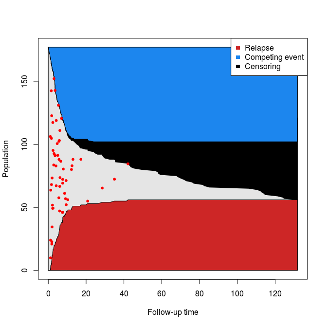
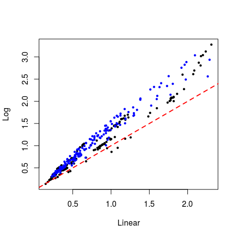

# Competing risk analysis using case-base sampling
Maxime Turgeon  
`r Sys.Date()`  

We will use the same data that was used in Scrucca *et al* [-@scrucca2010regression]. The data is available on the main author's [website](http://www.stat.unipg.it/luca/R/).


```r
DT <- read.csv(system.file("extdata", "bmtcrr.csv", package = "casebase"))
head(DT)
```

```
##   Sex   D   Phase Age Status Source  ftime
## 1   M ALL Relapse  48      2  BM+PB   0.67
## 2   F AML     CR2  23      1  BM+PB   9.50
## 3   M ALL     CR3   7      0  BM+PB 131.77
## 4   F ALL     CR2  26      2  BM+PB  24.03
## 5   F ALL     CR2  36      2  BM+PB   1.47
## 6   M ALL Relapse  17      2  BM+PB   2.23
```

We will perform a competing risk analysis on data from 177 patients who received a stem cell transplant for acute leukemia. The event of interest in relapse, but other competing causes (e.g. transplant-related death) need to be taken into account. We also want to take into account the effect of several covariates such as Sex, Disease (lymphoblastic or myeloblastic leukemia, abbreviated as ALL and AML, respectively), Phase at transplant (Relapse, CR1, CR2, CR3), Source of stem cells (bone marrow and peripheral blood, coded as BM+PB, or peripheral blood, coded as PB), and Age. Below, we reproduce their Table 1:

| Variable | Description            | Statistical summary    |
| -------- | ---------------------- | ---------------------- |
| Sex      | Sex                    | M=Male (100) <br> F=Female (77) |
| D        | Disease                | ALL (73) <br> AML (104) |
| Phase    | Phase                  | CR1 (47) <br> CR2 (45) <br> CR3 (12) <br> Relapse (73) |
| Source   | Type of transplant     | BM+PB (21) <br> PB (156) |
| Age      | Age of patient (years) | 4–62 <br> 30.47 (13.04) |
| Ftime    | Failure time (months)  | 0.13–131.77 <br> 20.28 (30.78) |
| Status   | Status indicator       | 0=censored (46) <br> 1=relapse (56) <br> 2=competing event (75) |

The statistical summary is generated differently for continuous and categorical variables: 

 - For continuous variables, we are given the range, followed by the mean and standard deviation.
 
 - For categorical variables, we are given the counts for each category.
 
Note that failure time can also correspond to censoring.

## Population-time plot

In order to try and visualize the incidence density of each event, we can look at a population-time plot: on the Y axis, we order the failure times from shortest (at the top) to longest (at the bottom). Then each line corresponds to the follow-up time of one individual. Failure times associated to the event of interest or a competing event can then be highlighted on the plot using coloured dots.


```r
nobs <- nrow(DT)
ftime <- DT$ftime
ord <- order(ftime, decreasing=FALSE)
#segments(rep(0.0, nobs), 1:nobs, ftime[ord], 1:nobs, col='gray25')
yCoords <- cbind(cumsum(DT[ord, "Status"] == 2), 
                 cumsum(DT[ord, "Status"] == 1),
                 cumsum(DT[ord, "Status"] == 0))
yCoords <- cbind(yCoords, nobs - rowSums(yCoords))

plot(0, type='n', xlim=c(0, max(ftime)), ylim=c(0, nobs), 
     xlab='Follow-up time', ylab='Population')
polygon(c(0, max(ftime), max(ftime), 0),
        c(0, 0, nobs, nobs), col = "grey90")
# Event of interest
polygon(c(0,ftime[ord], max(ftime), 0), c(0, yCoords[,2], 0, 0), col = "firebrick3")
# Censoring
polygon(c(0, ftime[ord], max(ftime), 0), c(nobs, nobs - yCoords[,1], nobs, nobs), col = "dodgerblue2")
# Competing event
polygon(c(0, ftime[ord], max(ftime), max(ftime), ftime[rev(ord)], 0), 
        c(nobs, nobs - yCoords[,1] - yCoords[,3], yCoords[nobs,1] + yCoords[nobs,3], yCoords[nobs,1],
          nobs - rev(yCoords[,1]), nobs), 
        col = "black")

cases <- DT[, "Status"] == 1

# randomly move the cases vertically
moved_cases <- yCoords[cases[ord], 2] + yCoords[cases[ord], 4] * runif(sum(cases))
points((ftime[ord])[cases[ord]], moved_cases, pch=20, col="red", cex=1)
legend("topright", legend=c("Relapse", "Competing event", "Censoring"), 
       col=c("firebrick3", "dodgerblue2", "black"),
       pch=15)
```



## Analysis


```r
library(casebase)
library(VGAM)
model1 <- fitSmoothHazard(Status ~ ftime + Sex + D + Phase + Source + Age, 
                          data = DT, ratio=100, type = "uniform", time="ftime")
summary(model1)
```

```
## 
## Call:
## vglm(formula = formula, family = multinomial(refLevel = 1), data = sampleData)
## 
## Pearson residuals:
##                        Min       1Q   Median       3Q   Max
## log(mu[,2]/mu[,1]) -0.2180 -0.07006 -0.03938 -0.01520 45.57
## log(mu[,3]/mu[,1]) -0.3567 -0.08915 -0.03759 -0.00851 20.84
## 
## Coefficients:
##                 Estimate Std. Error z value Pr(>|z|)    
## (Intercept):1  -3.539401   0.686632  -5.155 2.54e-07 ***
## (Intercept):2  -2.628009   0.468576  -5.609 2.04e-08 ***
## ftime:1        -0.069665   0.014814  -4.703 2.57e-06 ***
## ftime:2        -0.104169   0.018346  -5.678 1.36e-08 ***
## SexM:1         -0.214304   0.282772  -0.758 0.448531    
## SexM:2         -0.378821   0.236441  -1.602 0.109116    
## DAML:1         -0.617856   0.298720  -2.068 0.038607 *  
## DAML:2         -0.112814   0.274092  -0.412 0.680639    
## PhaseCR2:1      0.200823   0.467491   0.430 0.667505    
## PhaseCR2:2      0.348198   0.332281   1.048 0.294684    
## PhaseCR3:1      0.444663   0.690237   0.644 0.519434    
## PhaseCR3:2      0.209601   0.527067   0.398 0.690871    
## PhaseRelapse:1  1.473617   0.391538   3.764 0.000167 ***
## PhaseRelapse:2  0.812604   0.308848   2.631 0.008511 ** 
## SourcePB:1      0.395953   0.568329   0.697 0.485993    
## SourcePB:2     -1.156307   0.354862  -3.258 0.001120 ** 
## Age:1          -0.004824   0.012070  -0.400 0.689403    
## Age:2           0.030713   0.010078   3.048 0.002306 ** 
## ---
## Signif. codes:  0 '***' 0.001 '**' 0.01 '*' 0.05 '.' 0.1 ' ' 1
## 
## Number of linear predictors:  2 
## 
## Names of linear predictors: log(mu[,2]/mu[,1]), log(mu[,3]/mu[,1])
## 
## Dispersion Parameter for multinomial family:   1
## 
## Residual deviance: 1411.998 on 26444 degrees of freedom
## 
## Log-likelihood: -705.9992 on 26444 degrees of freedom
## 
## Number of iterations: 10
```


```r
model2 <- fitSmoothHazard(Status ~ log(ftime) + Sex + D + Phase + Source + Age, 
                          data = DT, ratio=100, type = "uniform", time="ftime")
summary(model2)
```

```
## 
## Call:
## vglm(formula = formula, family = multinomial(refLevel = 1), data = sampleData)
## 
## Pearson residuals:
##                        Min       1Q   Median       3Q   Max
## log(mu[,2]/mu[,1]) -0.4194 -0.06847 -0.04698 -0.03542 28.56
## log(mu[,3]/mu[,1]) -0.5738 -0.07693 -0.05469 -0.04486 22.40
## 
## Coefficients:
##                 Estimate Std. Error z value Pr(>|z|)    
## (Intercept):1  -3.873216   0.700849  -5.526 3.27e-08 ***
## (Intercept):2  -3.012973   0.465550  -6.472 9.68e-11 ***
## log(ftime):1   -0.336128   0.070011  -4.801 1.58e-06 ***
## log(ftime):2   -0.418718   0.057332  -7.303 2.81e-13 ***
## SexM:1         -0.450780   0.293135  -1.538 0.124101    
## SexM:2         -0.515065   0.241866  -2.130 0.033209 *  
## DAML:1         -0.650498   0.304905  -2.133 0.032889 *  
## DAML:2         -0.133861   0.286144  -0.468 0.639921    
## PhaseCR2:1      0.304958   0.467815   0.652 0.514480    
## PhaseCR2:2      0.410540   0.331428   1.239 0.215456    
## PhaseCR3:1      0.375483   0.707324   0.531 0.595523    
## PhaseCR3:2      0.077900   0.532403   0.146 0.883671    
## PhaseRelapse:1  1.496835   0.393290   3.806 0.000141 ***
## PhaseRelapse:2  0.889050   0.308449   2.882 0.003948 ** 
## SourcePB:1      0.570291   0.596808   0.956 0.339290    
## SourcePB:2     -1.050694   0.370127  -2.839 0.004529 ** 
## Age:1          -0.004187   0.011916  -0.351 0.725304    
## Age:2           0.029429   0.010116   2.909 0.003624 ** 
## ---
## Signif. codes:  0 '***' 0.001 '**' 0.01 '*' 0.05 '.' 0.1 ' ' 1
## 
## Number of linear predictors:  2 
## 
## Names of linear predictors: log(mu[,2]/mu[,1]), log(mu[,3]/mu[,1])
## 
## Dispersion Parameter for multinomial family:   1
## 
## Residual deviance: 1503.053 on 26444 degrees of freedom
## 
## Log-likelihood: -751.5265 on 26444 degrees of freedom
## 
## Number of iterations: 8
```


```r
linearRisk <- absoluteRisk(object = model1, time = 60, method = "montecarlo")
logRisk <- absoluteRisk(object = model2, time = 60, method = "montecarlo")

plot(linearRisk[,1], logRisk[,1],
     xlab="Linear", ylab = "Log", pch=19, cex=0.5)
points(linearRisk[,2], logRisk[,2],
       col = 'blue', pch=19, cex=0.5)
abline(a=0, b=1, lty=2, lwd=2, col='red')
```



## Session information


```
## R version 3.2.4 (2016-03-10)
## Platform: x86_64-pc-linux-gnu (64-bit)
## Running under: Ubuntu 14.04.4 LTS
## 
## locale:
##  [1] LC_CTYPE=en_CA.UTF-8       LC_NUMERIC=C              
##  [3] LC_TIME=en_CA.UTF-8        LC_COLLATE=en_CA.UTF-8    
##  [5] LC_MONETARY=en_CA.UTF-8    LC_MESSAGES=en_CA.UTF-8   
##  [7] LC_PAPER=en_CA.UTF-8       LC_NAME=C                 
##  [9] LC_ADDRESS=C               LC_TELEPHONE=C            
## [11] LC_MEASUREMENT=en_CA.UTF-8 LC_IDENTIFICATION=C       
## 
## attached base packages:
## [1] splines   stats4    stats     graphics  grDevices utils     datasets 
## [8] methods   base     
## 
## other attached packages:
## [1] casebase_0.0.9000 VGAM_1.0-0       
## 
## loaded via a namespace (and not attached):
##  [1] Rcpp_0.12.3      digest_0.6.9     chron_2.3-47     grid_3.2.4      
##  [5] plyr_1.8.3       gtable_0.1.2     formatR_1.3      magrittr_1.5    
##  [9] evaluate_0.8.3   scales_0.3.0     ggplot2_2.0.0    stringi_1.0-1   
## [13] data.table_1.9.6 rmarkdown_0.9.5  tools_3.2.4      stringr_1.0.0   
## [17] munsell_0.4.2    survival_2.38-3  yaml_2.1.13      colorspace_1.2-6
## [21] htmltools_0.3    knitr_1.12.3
```
## References
