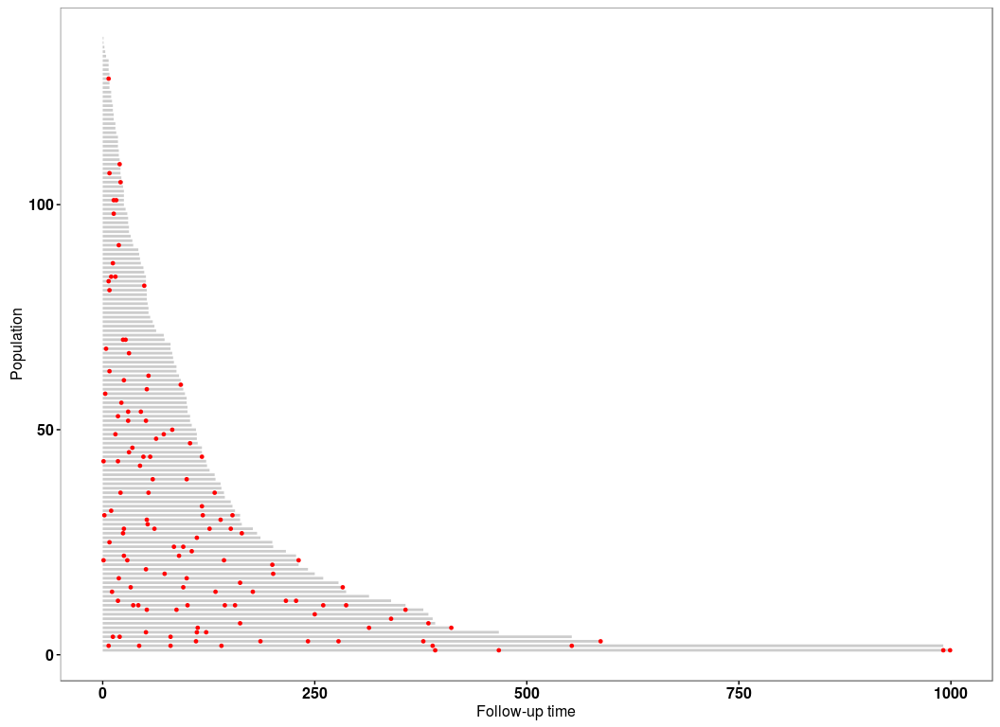
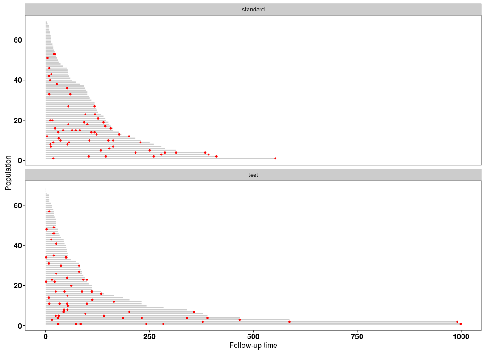
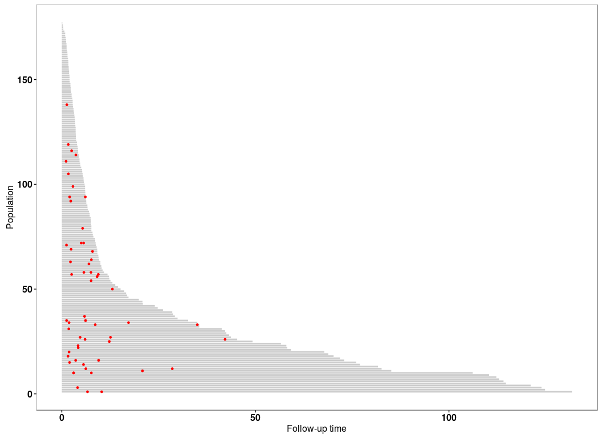
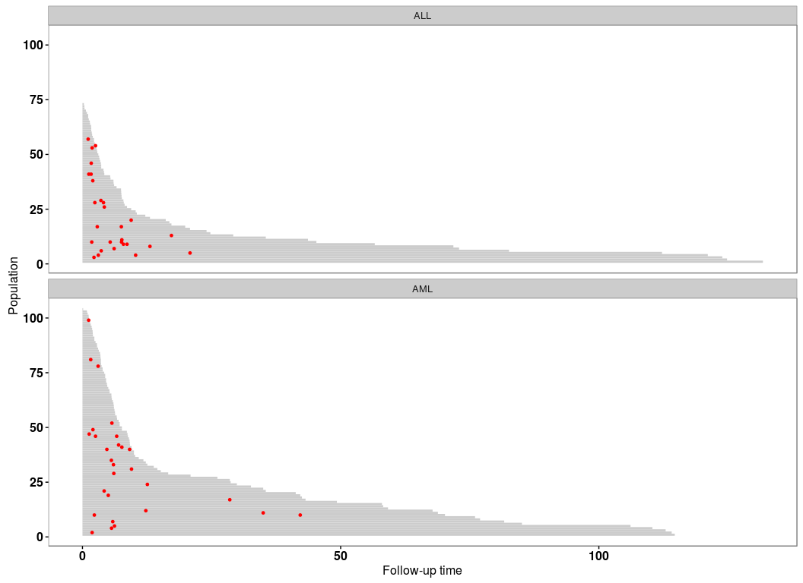
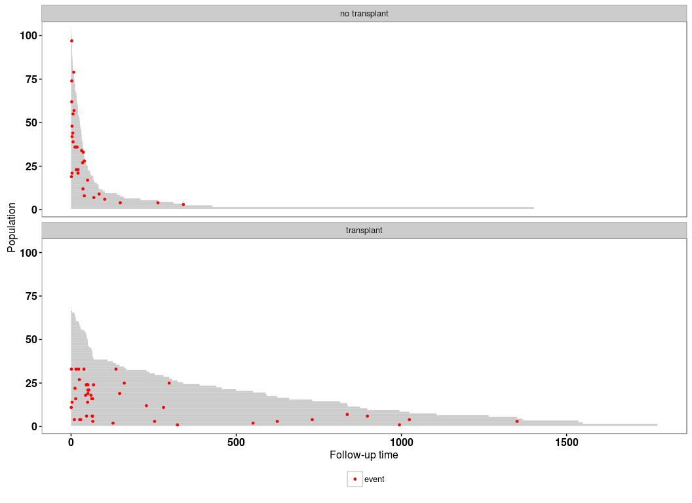
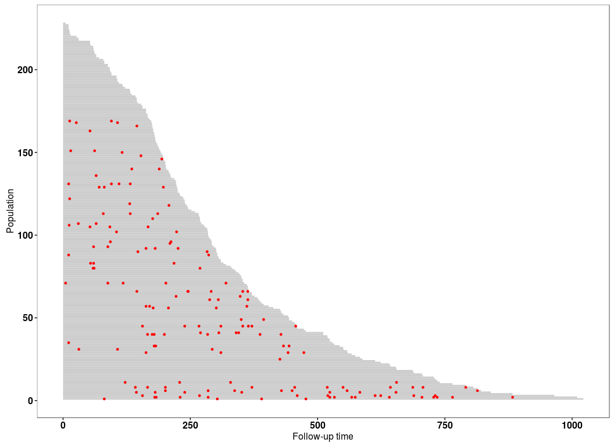
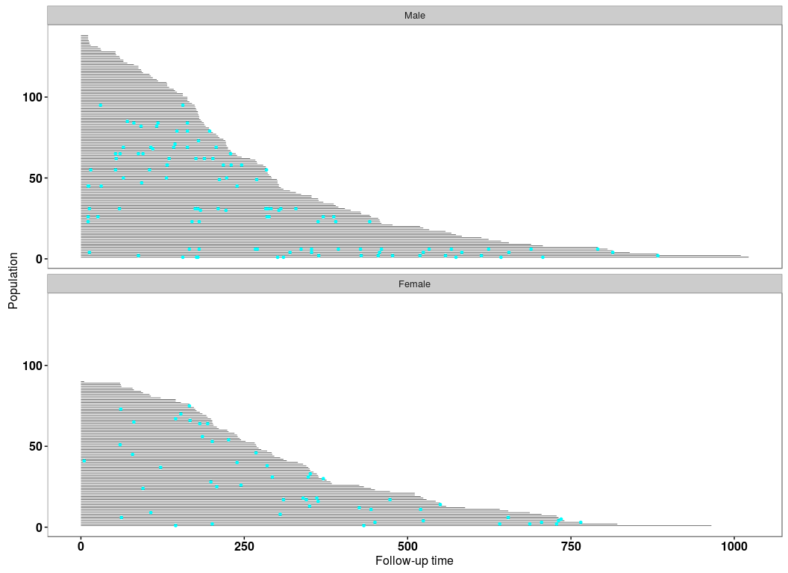

# Casebase Vignette
Sahir R. Bhatnagar  
`r Sys.Date()`  

# Load Required Packages


```r
library(knitr)
library(data.table)
library(magrittr)
library(ggplot2)
library(survival)
library(casebase)
```

# Veteran Data


```r
# veteran data in library(survival)
data("veteran")
str(veteran)
```

```
## 'data.frame':	137 obs. of  8 variables:
##  $ trt     : num  1 1 1 1 1 1 1 1 1 1 ...
##  $ celltype: Factor w/ 4 levels "squamous","smallcell",..: 1 1 1 1 1 1 1 1 1 1 ...
##  $ time    : num  72 411 228 126 118 10 82 110 314 100 ...
##  $ status  : num  1 1 1 1 1 1 1 1 1 0 ...
##  $ karno   : num  60 70 60 60 70 20 40 80 50 70 ...
##  $ diagtime: num  7 5 3 9 11 5 10 29 18 6 ...
##  $ age     : num  69 64 38 63 65 49 69 68 43 70 ...
##  $ prior   : num  0 10 0 10 10 0 10 0 0 0 ...
```

```r
# create 'popTime' object
popTimeData <- popTime(data = veteran)
```

```
## [1] 'time' will be used as the time variable
## [1] 'status' will be used as the event variable
```

```
## Sampling from all remaining individuals under study,
##                     regardless of event status
```

```r
# object of class 'popTime'
class(popTimeData)
```

```
## [1] "popTime"    "data.table" "data.frame"
```

```r
# plot method for objects of class 'popTime'
plot(popTimeData)
```

 

## Stratified by treatment population time plot


```r
# stratified by treatment population time plot
veteran <- transform(veteran, trt = factor(trt, levels = 1:2,
                                           labels = c("standard", "test")))

# create 'popTimeExposure' object
popTimeData <- popTime(data = veteran, exposure = "trt")
```

```
## [1] 'time' will be used as the time variable
## [1] 'status' will be used as the event variable
```

```
## Sampling from all remaining individuals under study,
##                     regardless of event status
## Sampling from all remaining individuals under study,
##                     regardless of event status
```

```r
# object of class 'popTimeExposure'
class(popTimeData)
```

```
## [1] "popTimeExposure" "list"
```

```r
# plot method for objects of class 'popTimeExposure'
plot(popTimeData)
```

 


# Stem Cell Data


```r
bmt <- read.csv("https://raw.githubusercontent.com/sahirbhatnagar/casebase/master/inst/extdata/bmtcrr.csv")
str(bmt)
```

```
## 'data.frame':	177 obs. of  7 variables:
##  $ Sex   : Factor w/ 2 levels "F","M": 2 1 2 1 1 2 2 1 2 1 ...
##  $ D     : Factor w/ 2 levels "ALL","AML": 1 2 1 1 1 1 1 1 1 1 ...
##  $ Phase : Factor w/ 4 levels "CR1","CR2","CR3",..: 4 2 3 2 2 4 1 1 1 4 ...
##  $ Age   : int  48 23 7 26 36 17 7 17 26 8 ...
##  $ Status: int  2 1 0 2 2 2 0 2 0 1 ...
##  $ Source: Factor w/ 2 levels "BM+PB","PB": 1 1 1 1 1 1 1 1 1 1 ...
##  $ ftime : num  0.67 9.5 131.77 24.03 1.47 ...
```

```r
# create 'popTime' object
popTimeData <- popTime(data = bmt, time = "ftime")
```

```
## [1] 'Status' will be used as the event variable
```

```
## Sampling from all remaining individuals under study,
##                     regardless of event status
```

```r
# object of class 'popTime'
class(popTimeData)
```

```
## [1] "popTime"    "data.table" "data.frame"
```

```r
# plot method for objects of class 'popTime'
plot(popTimeData)
```

 


## Stratified by Disease


```r
# stratified by Disease population time plot
# Disease (lymphoblastic or myeloblastic leukemia,
# abbreviated as ALL and AML, respectively)

# create 'popTimeExposure' object
popTimeData <- popTime(data = bmt, time = "ftime", exposure = "D")
```

```
## [1] 'Status' will be used as the event variable
```

```
## Sampling from all remaining individuals under study,
##                     regardless of event status
## Sampling from all remaining individuals under study,
##                     regardless of event status
```

```r
# object of class 'popTimeExposure'
class(popTimeData)
```

```
## [1] "popTimeExposure" "list"
```

```r
# plot method for objects of class 'popTimeExposure'
plot(popTimeData)
```

 

```r
# stratify by gender
popTimeData <- popTime(data = bmt, time = "ftime", exposure = "Sex")
```

```
## [1] 'Status' will be used as the event variable
```

```
## Sampling from all remaining individuals under study,
##                     regardless of event status
## Sampling from all remaining individuals under study,
##                     regardless of event status
```

```r
plot(popTimeData)
```

 


# Stanford Heart Transplant Data


```r
# data from library(survival)
data("heart")
str(heart)
```

```
## 'data.frame':	172 obs. of  8 variables:
##  $ start     : num  0 0 0 1 0 36 0 0 0 51 ...
##  $ stop      : num  50 6 1 16 36 39 18 3 51 675 ...
##  $ event     : num  1 1 0 1 0 1 1 1 0 1 ...
##  $ age       : num  -17.16 3.84 6.3 6.3 -7.74 ...
##  $ year      : num  0.123 0.255 0.266 0.266 0.49 ...
##  $ surgery   : num  0 0 0 0 0 0 0 0 0 0 ...
##  $ transplant: Factor w/ 2 levels "0","1": 1 1 1 2 1 2 1 1 1 2 ...
##  $ id        : num  1 2 3 3 4 4 5 6 7 7 ...
```

```r
# create time variable for time in study
heart <- transform(heart,
                   time = stop - start,
                   transplant = factor(transplant,
                                       labels = c("no transplant", "transplant")))

# stratify by transplant indicator
popTimeData <- popTime(data = heart, exposure = "transplant")
```

```
## [1] 'time' will be used as the time variable
## [1] 'event' will be used as the event variable
```

```
## Sampling from all remaining individuals under study,
##                     regardless of event status
## Sampling only from individuals who never experienced
##                     the event of interest
```

```r
# can specify a legend
plot(popTimeData, legend = TRUE)
```

 


# NCCTG Lung Cancer Data


```r
# data from library(survival)
data("cancer")
str(cancer)
```

```
## 'data.frame':	228 obs. of  10 variables:
##  $ inst     : num  3 3 3 5 1 12 7 11 1 7 ...
##  $ time     : num  306 455 1010 210 883 ...
##  $ status   : num  2 2 1 2 2 1 2 2 2 2 ...
##  $ age      : num  74 68 56 57 60 74 68 71 53 61 ...
##  $ sex      : num  1 1 1 1 1 1 2 2 1 1 ...
##  $ ph.ecog  : num  1 0 0 1 0 1 2 2 1 2 ...
##  $ ph.karno : num  90 90 90 90 100 50 70 60 70 70 ...
##  $ pat.karno: num  100 90 90 60 90 80 60 80 80 70 ...
##  $ meal.cal : num  1175 1225 NA 1150 NA ...
##  $ wt.loss  : num  NA 15 15 11 0 0 10 1 16 34 ...
```

```r
# since the event indicator 'status' is numeric, it must have
# 0 for censored and 1 for event
cancer <- transform(cancer,
                    status = status - 1,
                    sex = factor(sex, levels = 1:2,
                                 labels = c("Male", "Female")))


# population time plot
# redistributing the red points among those who never experienced an event
# because there are enough available at each time point
popTimeData <- popTime(data = cancer)
```

```
## [1] 'time' will be used as the time variable
## [1] 'status' will be used as the event variable
```

```
## Sampling only from individuals who never experienced
##                     the event of interest
```

```r
plot(popTimeData)
```

 


## Stratified by gender


```r
popTimeData <- popTime(data = cancer, exposure = "sex")
```

```
## [1] 'time' will be used as the time variable
## [1] 'status' will be used as the event variable
```

```
## Sampling only from individuals who never experienced
##                     the event of interest
## Sampling from all remaining individuals under study,
##                     regardless of event status
```

```r
# can change the plot aesthetics
plot(popTimeData,
     line.width = 0.2, line.colour = "black",
     point.size = 1, point.colour = "cyan")
```

 


# Simulated Data Example

## Simulate the data


```r
set.seed(1)
nobs <- 5000

# simulation parameters
a1 <- 1.0
b1 <- 200
a2 <- 1.0
b2 <- 50
c1 <- 0.0
c2 <- 0.0

# end of study time
eost <- 10

# e event type 0-censored, 1-event of interest, 2-competing event
# t observed time/endpoint
# z is a binary covariate
DTsim <- data.table(ID = seq_len(nobs), z=rbinom(nobs, 1, 0.5))
setkey(DTsim, ID)
DTsim[,`:=` (event_time = rweibull(nobs, a1, b1 * exp(z * c1)^(-1/a1)),
             competing_time = rweibull(nobs, a2, b2 * exp(z * c2)^(-1/a2)),
             end_of_study_time = eost)]
DTsim[,`:=`(event = 1 * (event_time < competing_time) +
                2 * (event_time >= competing_time),
            time = pmin(event_time, competing_time))]
DTsim[time >= end_of_study_time, event := 0]
DTsim[time >= end_of_study_time, time:=end_of_study_time]
```

## Population Time Plot


```r
# create 'popTime' object
popTimeData <- popTime(data = DTsim, time = "time", event = "event")
```

```
## Sampling from all remaining individuals under study,
##                     regardless of event status
```

```r
plot(popTimeData)
```

 

## Stratified by Binary Covariate z


```r
# stratified by binary covariate z
popTimeData <- popTime(data = DTsim, time = "time", event = "event", exposure = "z")
```

```
## Sampling from all remaining individuals under study,
##                     regardless of event status
## Sampling from all remaining individuals under study,
##                     regardless of event status
```

```r
# we can line up the plots side-by-side instead of one on top of the other
plot(popTimeData, ncol = 2)
```

 


